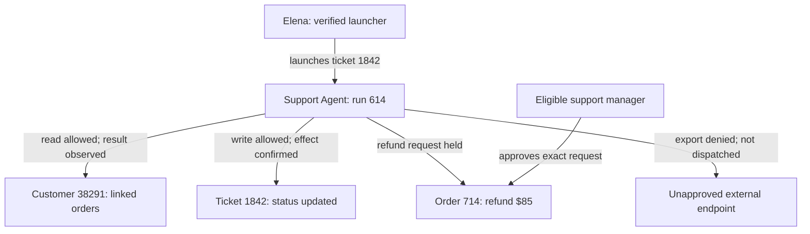
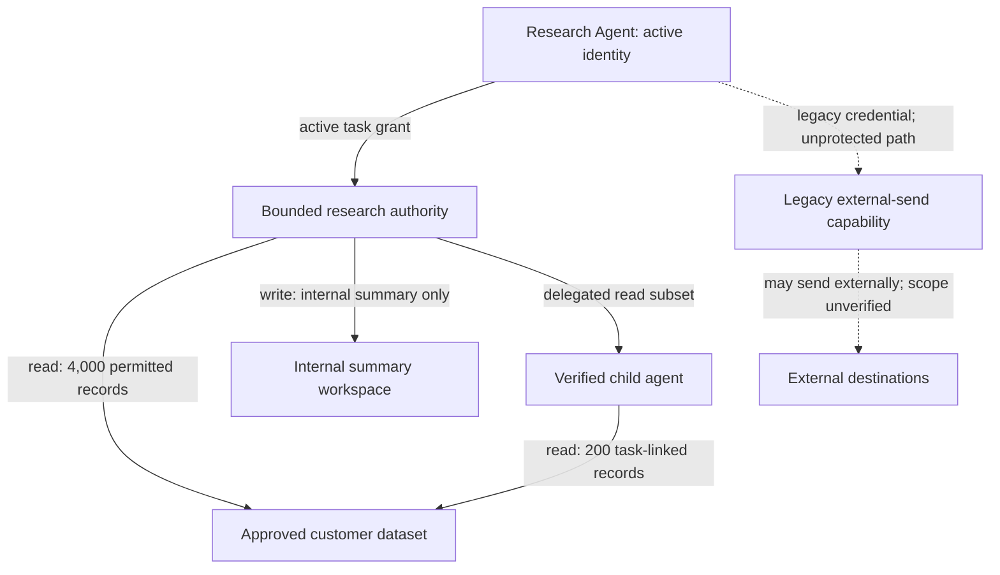
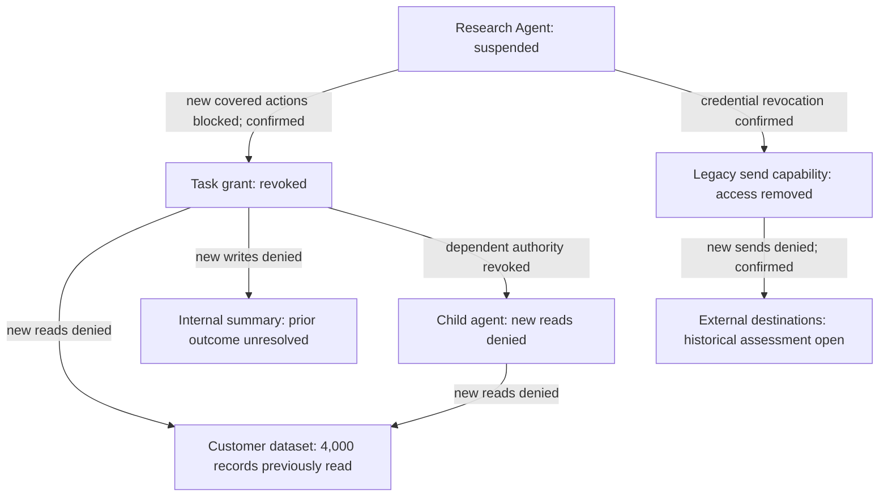
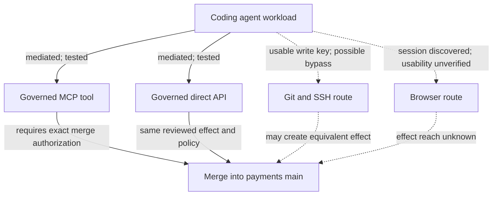
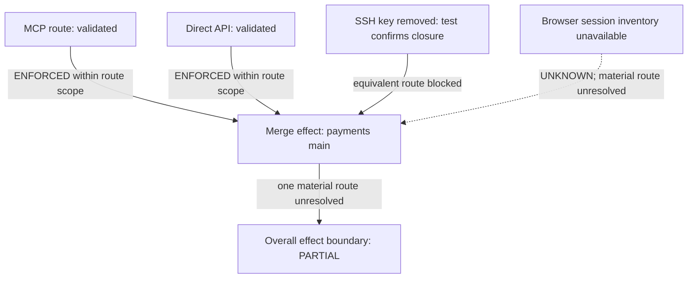
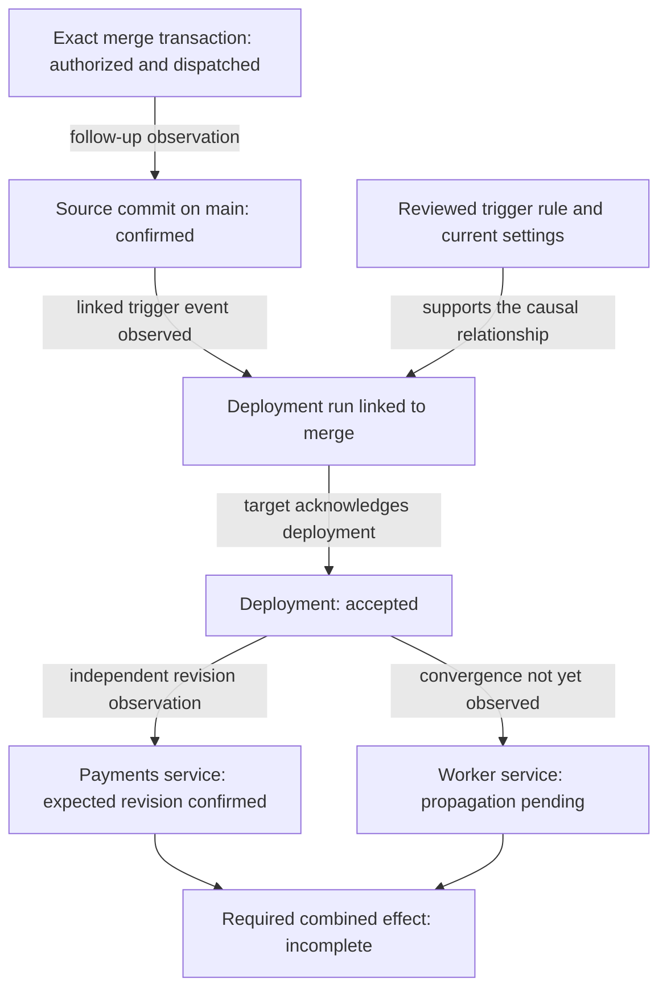
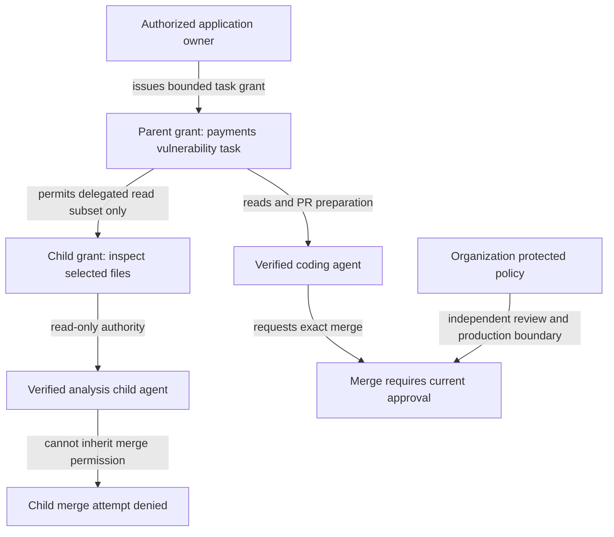
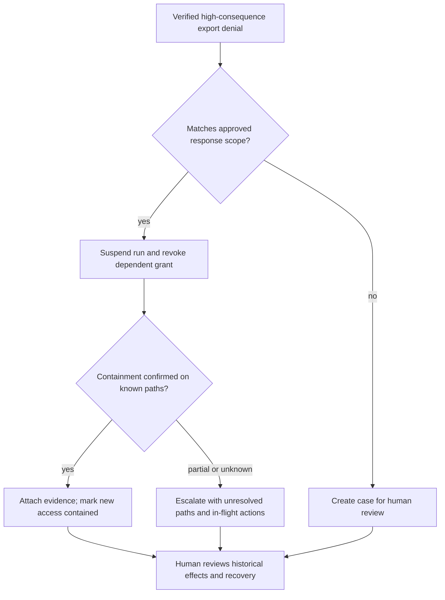

# PantherClaw — AI Agent Identity + Runtime Authorization Firewall

> **Reference document — requirements traceability source (F001–F802, SG01–SG14).** It defines desired product behavior, not implementation. The authoritative build guidance is [`docs/BUILD_GUIDE.md`](../BUILD_GUIDE.md); architecture, protocol and security rules in [`docs/ARCHITECTURE.md`](../ARCHITECTURE.md), [`docs/protocol/PAP-1.md`](../protocol/PAP-1.md) and [`docs/security/`](../security/) take precedence where they are more specific. Licensed under the repository [LICENSE](../../LICENSE).

**Product design specification**  
**Status:** Proposed product behavior for a founding product, design, and engineering team  
**Version:** 2.1  
**Date:** October 7, 2026

> Give an agent useful authority. Make every consequential action explainable. Stop that authority when it is no longer appropriate.

This document defines the complete intended product: its user experience, objects, controls, workflows, and observable requirements. Sections 1–43 do not assign capabilities to releases or prescribe implementation architecture. Section 44 adds required secure engineering governance; detailed controls are recorded in the companion plan. PantherClaw is the product name (formerly the working name "AgentGate"). Described capabilities remain requirements, not claims of implementation or production readiness.

## Reading guide

- **Sections 1–8:** Product position, users, mental model, and navigation.
- **Sections 9–12:** Identity, authorization, policies, and delegated authority.
- **Sections 13–20:** Live operations, investigation, approvals, and evidence.
- **Sections 21–29:** Onboarding, integrations, response, governance, and failure behavior.
- **Sections 30–37:** Complete scenarios, differentiation, full product scope, and experience principles.
- **Section 38:** Automation as a core work surface: creation, authority, execution, recovery, and rollout.
- **Sections 39–42:** Credential custody, reviewed action meaning, continuous coverage, and exact outcome evidence.
- **Section 43:** A complete cross-system transaction scenario connecting these capabilities.
- **Section 44:** Required secure engineering process for building PantherClaw, linked to the screenshot audit and companion plan.

**Version 2.1:** Adds §44 and the required [secure engineering requirements](../security/GATES_AND_REVIEW.md) to cover the guidance in both supplied screenshots. Existing product requirements and release-neutral scope remain intact. This revision documents engineering obligations; no implementation or completed review is asserted.

**Version 2.0:** Reconciles the product behavior with the supplied PantherClaw descriptions. Adds precise authority-to-effect requirements, continuous bypass validation, reviewed downstream consequences, distinct effect states, evidence receipts, and richer graphs. Automations remain a core capability. Release sequencing and technology choices are excluded.

---

## 1. Product thesis

The unit of security is an **agent action performed under a specific grant of authority**.

Its durable product record is a **transaction**: the exact logical request, authority, decision, human requirements, execution attempts, and observed effects. One run may contain many transactions; a retry does not automatically create a new one.

An agent may be legitimate, its credential valid, and its destination permitted—and still attempt the wrong action. The product must make that distinction understandable and enforceable.

### The central promise

For any consequential action, an operator can answer:

- Which agent attempted it?
- Who launched it, and whom does it represent?
- Which task and authority grant cover it?
- What exactly will change or become accessible?
- Which constraints apply right now?
- What happened after the authorization decision?

### The product bet

Developers will grant agents more useful capabilities when boundaries are precise and failures are understandable.

Security teams will permit more autonomy when they can inspect authority, constrain actions, and verify containment from one workspace.

### The honest boundary

The platform governs actions at connected enforcement points. It does not claim to control tools, credentials, or paths that bypass those points.

Every protection claim must therefore include its **scope and coverage evidence**.

Within a declared enforced boundary, the product authorizes the consequential effect before usable target authority is exercised. It binds execution to the authorized action and records target acceptance separately from effect verification.

An agent may request authority. It cannot create, expand, approve, or attest its own authority. Explicitly delegated grant issuance by an approved automation is a separately governed capability with a fixed ceiling.

## 2. The category this product creates

**Execution authority for software agents** is the proposed category. The customer-facing description is an **agent transaction firewall**.

It combines four experiences that belong together:

1. **Identity:** Establish which agent is acting.
2. **Authority:** Establish who permitted what, for which task, and for how long.
3. **Runtime control:** Decide whether a specific action may proceed.
4. **Accountability:** Explain the decision, execution result, and resulting exposure.

The defining distinction is **authority tied to a run and an action**, rather than a standing list of systems an identity can access.

### Where customers start

The initial customer has agents that already use valuable tools and needs to move beyond broad service credentials or manual supervision.

The first buying problem is concrete:

> “We want this agent to update support records and issue small refunds, but we cannot let it export every customer or issue unlimited refunds.”

The product should solve that narrow problem before asking the customer to inventory the entire enterprise.

## 3. What the product is—in one paragraph

PantherClaw connects verified agent identity and delegated authority to an exact, governed effect. Teams define task boundaries, approve tool meanings and downstream consequences, control access custody, and validate equivalent routes. Runtime decisions permit, constrain, hold, deny, or report that required evidence is insufficient. Approved actions execute within current authority; evidence distinguishes acceptance from confirmed effects. Graphs expose activity, authority, bypasses, and blast radius. Governed automations perform repeatable work, while operators investigate, approve, simulate, and contain from one coherent workspace.

## 4. What the product is not

- **A general identity replacement:** Existing human identity systems remain the source of human identity.
- **A generic log warehouse:** The product organizes evidence around authority and action consequences.
- **A prompt correctness guarantee:** It cannot prove that every instruction, model output, or plan is safe.
- **An agent builder:** Customers bring agents; the product governs their access and behavior.
- **A universal rollback engine:** Completed transfers, disclosures, and deletions may require separate recovery.
- **A conversation surveillance tool:** Raw conversations and hidden model reasoning are not required for core protection.
- **An autonomous security commander:** Suggested responses do not silently expand the platform's own authority.

## 5. Core product principles

### Authority must be explicit

An agent's description, task claim, or confidence is never sufficient permission.

Trusted grants and applicable policies establish authority. Agent-provided context may explain a request, but cannot enlarge its scope.

### Restrictions compose; permissions do not accumulate casually

Effective authority is limited by the grant, represented principal's permitted scope, resource restrictions, organizational controls, and current containment state.

A local allow rule cannot defeat an organizational prohibition.

### Protection is a claim with evidence

“Connected,” “observed,” and “enforced” are separate states.

A connected agent with one protected tool and three unprotected tools is shown as **partially protected**.

### Decisions and outcomes are separate

Allowed does not mean executed. Executed does not mean successful. Missing evidence does not mean harmless.

### The safe next step should be visible

A blocked developer sees the exact failed condition and a permitted alternative or exception path.

An analyst sees containment controls appropriate to the evidence and their role.

### Machine speed, human clarity

Routine decisions should not require a person. Human attention is reserved for meaningful consequences, uncertainty, and governance.

### Automate repeatable work within explicit authority

Routine protection, task launches, evidence collection, routing, and scoped response should run automatically when preauthorized conditions are met.

The automation's trigger does not grant permission. Each resulting action still needs valid authority and an explainable decision.

### Evidence precedes inference

Observed facts, deterministic policy results, and inferred suspicion have distinct labels.

The interface never presents an inferred explanation as a confirmed cause.

## 6. Primary users and what each needs

| User | Job to complete | Default view | Desired feeling |
| --- | --- | --- | --- |
| Agent developer | Give an agent useful tools without broad standing permission | Agent and recent runs | “I know how to fix the blocked action.” |
| SOC analyst | Understand and contain a suspicious sequence | Operations and investigation | “I can reconstruct this without guessing.” |
| Security engineer | Define boundaries and evaluate changes | Policies and posture | “The controls are precise and testable.” |
| IAM engineer | Trace ownership, delegation, and revocation | Identity and authority | “Every grant has an accountable origin.” |
| Platform engineer | Verify coverage and reliable operation | Connections and health | “I can see exactly where enforcement works.” |
| CISO | Judge exposure and response readiness | Scoped posture summary | “Our confidence is grounded in evidence.” |
| Auditor | Reconstruct decisions and approved changes | Evidence collections | “I can verify who authorized what.” |
| Business approver | Decide on a consequential request | Approval detail | “I understand the action and its consequence.” |

All users inspect the same agents, grants, actions, and decisions. Saved views change emphasis; they do not create separate versions of the truth.

## 7. The product's core mental model

Use six primary objects. Everything else is context, evidence, or a workflow attached to them.

| Object | Meaning | Example |
| --- | --- | --- |
| **Agent** | Accountable software actor with an owner and verified identity | Support Resolution Agent |
| **Run** | One execution session with a declared task and bounded authority | Resolve ticket 1842 |
| **Resource** | A governed target, reached through a tool or connection | Customer 38291; production deployment |
| **Grant** | Permission delegated by an authorized principal | Refund this order up to $100 until 16:00 |
| **Policy** | A rule that constrains grants and runtime actions | New payees require two approvers |
| **Action** | A concrete attempt, its decision, and its outcome | Issue $85 refund to order 714 |

The action detail is the **transaction record**. It groups retries and follow-up observations under one logical action identity rather than treating each network attempt as new permission.

### Supporting concepts

- **People and services** launch runs, delegate authority, or approve actions.
- **Tools** describe operations available against resources.
- **Connections** establish discovery, observation, or enforcement capabilities.
- **Approvals** satisfy specific action conditions; they are not general access grants.
- **Incidents** group related actions and response work.
- **Automations** coordinate repeatable work over these objects; every execution creates attributable runs and governed actions.
- **Teams and environments** scope ownership, policies, and visibility.
- **Action definitions** establish reviewed operation meaning across tools and channels.
- **Consequence rules** identify supported downstream effects under verified conditions.
- **Coverage records** state which equivalent routes are enforced and when that evidence expires.
- **Receipts** retain separate decision, execution, and effect evidence.

### Precise vocabulary without a technical interface

| Product term | Meaning users must understand | Corresponding supplied specification term |
| --- | --- | --- |
| Task grant | Bounded authority with issuer, scope, constraints, validity, and revision | AuthorizationEnvelope / DelegationGrant |
| Action definition | Exact effect, resource, and material parameters independent of tool name | ActionIR |
| Reviewed tool package | Approved mappings, constraints, behavior evidence, and supported verification | SemanticPackage |
| Downstream consequence | A bounded effect an action may trigger under named conditions | ConsequenceIR |
| Protection boundary | Workload, target, effect, routes, controls, exclusions, and evidence period | EnforcementBoundary |
| Coverage evidence | Current proof of protection and unresolved equivalent routes | CoverageSnapshot / AuthorityPath |
| Transaction evidence | Decision, execution, acceptance, and effect recorded separately | DecisionReceipt / ExecutionReceipt / EffectReceipt |

These terms describe customer-visible behavior. The interface should prefer the plain-language terms and reveal formal identifiers only in advanced evidence views.

### Why this model

Separating identity from a grant prevents “this is our agent” from meaning “it may do everything.”

Separating a run from an agent prevents yesterday's task from becoming today's authority.

Treating decisions as part of an action keeps authorization and execution evidence together.

### Example in plain language

> Elena launched the Support Resolution Agent to resolve ticket 1842. The run received a grant to read one customer's orders and issue one refund up to $100. Policy requires approval above $50. Its $85 refund request is waiting for an eligible manager.

## 8. The main product surfaces

Primary navigation has seven destinations: **Operations, Agents, Policies, Approvals, Investigations, Connections, Automations**.

Universal search is always available. Posture is an opinionated view within Operations, not another disconnected dashboard. Organization settings sit outside the daily workflow.

### 8.1 Operations

- **Purpose:** Show what needs attention now.
- **Primary question:** “Is anything consequential waiting, failing, or escaping control?”
- **Information:** Active incidents, waiting approvals, material authority changes, protection gaps, significant actions, and freshness.
- **Actions:** Inspect, assign, suspend a run, revoke a grant, or open an approval.
- **Behavior:** Updates live; preserves the item under the user's cursor and groups related changes.
- **Drill-down:** Action detail, run timeline, incident, or affected connection.
- **Exclude:** Total tool-call counters as the main story, decorative maps, and ordinary successful reads.

### 8.2 Agents

- **Purpose:** Make ownership, identity, authority, and coverage inspectable.
- **Primary question:** “What can this agent do, and who is responsible?”
- **Information:** Agent identity, owner, environment, active grants, protected paths, unresolved findings, and runs.
- **Actions:** Claim ownership, test identity, inspect access, tighten a grant, suspend, or retire.
- **Behavior:** New discoveries enter an unclaimed queue; authority and coverage changes appear as explicit changes.
- **Drill-down:** Agent detail, represented principal, grant lineage, tool, or run.
- **Exclude:** A raw asset table that requires users to infer security significance.

### 8.3 Policies

- **Purpose:** Change boundaries with evidence of consequences.
- **Primary question:** “What will this rule change, and is that intended?”
- **Information:** Effective rules, inheritance, versions, simulation results, conflicts, and rollout state.
- **Actions:** Draft, test, simulate, request review, stage, publish, or roll back.
- **Behavior:** Editing creates a draft; publishing never happens through an incidental save.
- **Drill-down:** Matching actions, affected teams, rule clauses, and approval history.
- **Exclude:** Unreviewable natural-language rules or hundreds of unexplained switches.

### 8.4 Approvals

- **Purpose:** Resolve exact requests requiring human authority.
- **Primary question:** “Should this specific action proceed under these conditions?”
- **Information:** Request, consequence, task, authority source, required approvers, expiry, and live validity.
- **Actions:** Approve exact action, decline with reason, request evidence, or propose a narrower action.
- **Behavior:** Parameter or authority changes invalidate the pending request; eligibility is checked at decision time.
- **Drill-down:** Decision explanation, resource preview, task evidence, or prior similar requests.
- **Exclude:** A bare Approve/Reject dialog or a hidden option to permanently widen access.

### 8.5 Investigations

- **Purpose:** Reconstruct a sequence and manage response in one workspace.
- **Primary question:** “What happened, what is exposed, and what can I contain?”
- **Information:** Timeline, authority lineage, actual effects, potential reach, uncertainty, related activity, and response status.
- **Actions:** Contain, preserve evidence, assign, annotate, query related actions, and export a case.
- **Behavior:** New evidence extends the case without replacing analyst notes or silently changing conclusions.
- **Drill-down:** Individual action, credential relationship, principal, policy version, or resource.
- **Exclude:** Seven separate modules for seven stages of the same investigation.

### 8.6 Connections

- **Purpose:** Establish and verify what the platform can see and control.
- **Primary question:** “Which paths are covered, and what is currently missing?”
- **Information:** Connection health, capabilities, permissions, tool catalog, enforcement tests, and delivery failures.
- **Actions:** Connect, test, approve capabilities, quarantine, rotate access where supported, or disconnect.
- **Behavior:** Capability drift and stale signals create explicit coverage changes.
- **Drill-down:** Tool contract, protected resource scope, recent tests, and dependent agents.
- **Exclude:** A logo catalog that hides actual capabilities and limits.

### 8.7 Automations

- **Purpose:** Turn approved repeatable work into reliable, governed execution.
- **Primary question:** “What will run automatically, under whose authority, and what happens if it fails?”
- **Information:** Trigger, owner, execution identity, scope, version, grant requirements, next run, recent outcomes, approvals, and recovery state.
- **Actions:** Create from a template, simulate, test, enable, pause, inspect, safely retry, revise, or retire.
- **Behavior:** Each trigger creates a visible execution; authority drift, failed prerequisites, and ambiguous outcomes stop affected work unless wider suspension is warranted.
- **Drill-down:** Workflow graph, step decisions, run timeline, authority lineage, affected resources, and delivery evidence.
- **Exclude:** Unrestricted generic workflow building, hidden service credentials, and a success label when only a trigger was delivered.

### Shared interaction rules

- Lists open details without losing filters, selection, or time range.
- A link to an action opens the same evidence in every surface.
- Scope is always visible: organization, team, environment, and time range.
- Live updates never reorder an approval while someone is reviewing it.
- Destructive controls show target count, scope, and consequence before commitment.
- All meaningful controls work with keyboard navigation and accessible status text.

### Task navigation across the same surfaces

Customers may pin task-oriented entry points without creating separate records or changing permission semantics.

| Task group | Customer goal | Related surfaces and views |
| --- | --- | --- |
| Work | Resolve transactions, approvals, and cases | Action details, Approvals, Investigations, automation executions |
| Protect | Understand authority and close exposure | Agents, Coverage workbench, posture, bypass and blast-radius graphs |
| Configure | Define allowed behavior and connect resources | Policies, Connections, tool meaning, identity, automation editor |
| Operations | Resolve unhealthy dependencies and uncertain outcomes | Operations, connection health, reconciliation, containment, recovery |
| Audit | Reconstruct authorized work and privileged changes | Evidence explorer, receipts, exports, retention, governance history |

Coverage, tool meaning, and evidence are directly accessible workbenches inside these surfaces. They are never buried behind a generic configuration page.

## 9. Agent inventory and identity

### Agent identity is accountable continuity

An agent has a stable identity for ownership and history. Each run has its own identity context and active grants.

The identity record distinguishes:

- Organization and owning team.
- Accountable owner and backup owner.
- Launcher: human or service that started this run.
- Represented principal: whose authority the agent uses.
- Agent release or configuration identity, where verifiable.
- Actual workload instance and its verification basis, separate from the named agent definition.
- Calling application and execution actor where they differ from the agent.
- Environment and connected execution context.
- Verification method, last verification, and unresolved ambiguity.

A model name, display name, or self-reported identifier is not sufficient verification.

### Discovery states

| State | What it means | Next useful action |
| --- | --- | --- |
| Discovered | Evidence suggests agent activity | Confirm ownership and identity |
| Claimed | A team accepts ownership | Verify the execution identity |
| Verified | Identity evidence meets the chosen trust requirement | Define tasks and grants |
| Observed | Covered activity can be reconstructed | Test enforcement |
| Partially protected | Some action paths enforce controls | Close named gaps |
| Protected within scope | Required equivalent routes are controlled or affirmatively blocked, with current evidence | Monitor expiry and invalidation |
| Suspended | New covered actions are refused | Investigate or restore deliberately |
| Retired | New runs are disabled; history remains | Review residual access |

### Agent detail

The default summary answers five questions:

1. Who owns it?
2. What is its permitted purpose?
3. What authority is active now?
4. Which paths are covered?
5. What needs attention?

Tabs reveal **Runs, Authority, Resources, Changes, and Evidence**.

“Can access” distinguishes standing credential reach, active delegated authority, and effective policy-constrained authority.

### Identity drift

A changed release, tool schema, or execution context triggers reassessment appropriate to the affected capability.

The product must not silently transfer sensitive authority to a newly discovered actor with the same name.

Ambiguous identities remain separate until an authorized user resolves them with evidence. Historical identity changes remain visible.

## 10. Runtime authorization experience

### 10.1 The action card

Each governed attempt has a concise human-readable card:

> **Support Resolution Agent wants to refund $85 for order 714.**  
> Acting for Elena · Ticket 1842 · Production  
> **Held for approval:** Refunds above $50 require a support manager.  
> Grant permits one refund up to $100 and expires at 16:00.  
> **Execution:** Not started.

Expanded details show parameters, resource identity, sensitivity, current constraints, applicable rule versions, and provenance of contextual facts.

Secrets are removed from normal displays. Authorized evidence access is separately audited.

### 10.2 Precise decisions with simple presentation

Use five readable presentations. Preserve the exact underlying decision and requirements in every action record.

| Presentation | User meaning | Required behavior |
| --- | --- | --- |
| **Allow** | The exact action is permitted and its prerequisites are satisfied | Proceed only within recorded scope |
| **Constrain** | Permission includes explicit enforceable limits or modifications | Complete required constraints before execution; show the effective action |
| **Hold** | Exact approval or stronger authentication is required | No consequential execution until requirements and current authority are rechecked |
| **Deny** | Current policy or delegated authority prohibits the action | State the failed boundary and permitted recovery path |
| **Cannot authorize** | Required identity, action meaning, history, policy, coverage, or other evidence is missing or unusable | Stop consequential execution; identify what evidence must be restored |

| Precise decision | Presentation | Distinction that must remain visible |
| --- | --- | --- |
| `ALLOW` | Allow | Permission is not proof of dispatch or effect |
| `ALLOW_WITH_OBLIGATIONS` | Constrain, or Hold while a required prerequisite remains incomplete | List every obligation and whether it applies before or after execution |
| `REQUIRE_APPROVAL` | Hold: approval required | Exact business approval is missing |
| `REQUIRE_STEP_UP` | Hold: stronger authentication required | Authentication evidence is missing; this is separate from business approval |
| `DENY` | Deny | The action is prohibited under current authority or policy |
| `CANNOT_AUTHORIZE` | Cannot authorize | The product lacks a required basis for a decision; do not label it a business-policy prohibition |

An action can require both approval and stronger authentication. Completing one must not silently satisfy the other.

“Allow once” is an allowance with a single-use scope. “Read only” is an action boundary. “Warn” is an annotation, never a substitute for a required block.

An unsupported required obligation is Cannot authorize. The product cannot drop a constraint, approval requirement, or verifier requirement merely because a connection cannot satisfy it.

Quarantine, suspend, and terminate are **response actions**, shown separately from the decision.

### 10.3 The decision sequence

The decision explorer presents the checks in a consistent order:

1. **Scope and coverage:** Which workload, target, effect, and routes can be governed with current evidence?
2. **Identity:** Are the agent instance, calling application, launcher, represented principal, and relevant executor sufficiently verified?
3. **Containment:** Is any required actor, grant, connection, resource, or tool package suspended?
4. **Authority:** Does a valid, sufficiently narrow grant cover the task and target?
5. **Exact meaning:** What operation, stable resource, material parameters, and supported consequences does the request represent?
6. **Current facts:** Are required target conditions, history, and classifications present and fresh?
7. **Boundaries:** Do permits, prohibitions, sequence rules, time windows, and cumulative limits fit?
8. **Requirements:** Which approval, authentication, constraint, access-custody, and verification requirements apply?
9. **Final authorization:** Does the exact effective action still match its authority, consent, facts, and limits?
10. **Observe effects:** Record dispatch, acceptance, and supported effect observations separately.

An action outside enforcement coverage receives an **uncontrolled/observed** label, not a fabricated allow or deny.

A denial on a controlled route can coexist with Partial coverage for the overall effect. Display both: “This attempt was blocked; a separate equivalent route remains unresolved.”

### 10.4 Policy composition

- Applicable explicit prohibitions deny the action.
- Limits compose by intersection; the tighter applicable limit wins.
- Compatible approval requirements combine.
- Conflicting or unsatisfiable requirements deny with a conflict explanation.
- Missing required decision evidence produces `CANNOT_AUTHORIZE`. A workflow may wait for recovery within a deadline, but no consequential action proceeds while the evidence is missing.
- No applicable grant means deny within an enforced scope.
- Observe-only policies report a hypothetical result and cannot claim that the action was stopped.

The interface shows all material rules, including the decisive rule and other restrictions that still apply.

### 10.5 Task context without trusting the agent's story

A task is an approved boundary, not a persuasive paragraph.

For “resolve ticket 1842,” the trusted scope may contain:

- Ticket and linked customer identifiers.
- Permitted operations.
- Maximum refund and total task budget.
- Allowed data destinations.
- Expiration and delegation permissions.

“I need payroll to resolve this ticket” does not expand that scope.

Semantic analysis may flag a mismatch for review. It cannot create new authority or silently overrule an explicit prohibition.

### 10.6 Safe constraints and transformations

Supported constraints are declared per tool. They include row limits, selected fields, approved destinations, target sets, and bounded amounts.

Automatic changes are permitted only when the tool contract declares them semantically safe and the grant authorizes that form.

Examples:

- A customer lookup may return only permitted fields when the tool supports field filtering.
- An export may be constrained to customer records linked to the approved task.
- An $85 refund must not silently become a $50 refund. That changes the business action and requires a revised request.
- A destructive shell command must not be rewritten into another command by guessing intent.
- Response redaction applies only where the connection can reliably govern the returned data; unsupported paths cannot claim redaction.

Every modification is visible as **requested versus effective action**.

Final consent binds the effective action and every material field. If a permitted transformation changes a field after approval, obtain renewed approval unless that exact transformation and resulting scope were explicitly authorized in the original request.

### 10.7 Cumulative limits

Per-call limits alone are insufficient. A grant can also limit:

- Total value across a run, task, or defined period.
- Number of writes, recipients, records, or delegations.
- Rate and maximum concurrent outstanding actions.

The product shows **available, reserved, spent, and unresolved** amounts.

Concurrent requests cannot each claim the same remaining budget. An unknown transfer outcome retains its reservation until reconciled.

Each limit states its scope: task, represented principal, target account, team, or other approved grouping. Related runs and child grants cannot escape a shared limit merely by using new identifiers.

### History and sequence boundaries

Policies can express sequences such as:

- Do not transfer to a supplier whose bank details changed within the defined review window without independent review.
- Permit at most one protected merge per task.
- Require a verified backup before a supported destructive maintenance action.
- Hold an external disclosure after a sensitive read unless a reviewed task explicitly permits that data flow.

The policy identifies which evidence counts: attempted action, provider acceptance, confirmed effect, or another explicitly defined event. The explanation shows the relevant prior transactions, time window, and freshness.

Model memory and agent-written summaries cannot establish those facts. Missing required history is `CANNOT_AUTHORIZE`, not an empty history.

### Requirement timing

- **Before execution:** Verify identity and grants; satisfy approval and authentication; reserve required budgets; apply supported constraints; confirm suitable access and verification capability.
- **After dispatch:** Observe required effects and reconcile ambiguity.
- **Before dependent work:** Confirm any effect state the next step requires.

A post-action verifier cannot retroactively authorize an earlier prohibited action. A missing verifier result cannot be invented to let dependent work continue.

### 10.8 Retries and changing conditions

- A retry of an irreversible operation must retain its original action identity or undergo reconciliation.
- An expired approval never permits a later execution.
- Changed parameters, payee, target, represented user, or task require a new decision.
- Revocation prevents new covered actions and invalidates waiting approvals.
- Already dispatched actions show their actual cancellation capability and status.
- Outcome unknown means **reconcile before retry**, not “try again automatically.”

### 10.9 Concrete decisions

| Attempt | Context | Decision | Explanation and next step |
| --- | --- | --- | --- |
| `delete_customer(customer_id=38291)` | Support task permits record updates, not deletion | Deny | Deletion is absent from the grant; request a separate retention-approved workflow |
| `kubectl delete namespace production` | Diagnostic run, read-only production access | Deny | Production deletion is prohibited; no approval button can override the prohibition |
| `SELECT * FROM payroll` | Support run has no payroll grant | Deny | Payroll is outside the task and resource scope |
| Payroll reporting request | Verified payroll task permits aggregate salary totals only | Constrain, if supported | Use the approved aggregate operation; refuse unrestricted row access |
| `send_wire_transfer(amount=250000)` | Treasury grant covers the amount and known payee, but requires two independent approvers | Hold | Display payee, currency, total task exposure, and both approval requirements |
| Same wire transfer | Grant limit is $100,000 | Deny | Approval cannot satisfy an amount outside the grant; authorized grant revision is separate |
| `POST /deployments/production` | Approved release, valid change window, named project | Hold or allow | Hold for required release approval; allow after exact release and current conditions are verified |

### 10.10 Decision, execution, and effect are separate

**Execution lifecycle:**

| State | Meaning |
| --- | --- |
| Requested | The logical action was received and attributed |
| Blocked | No dispatch occurred because of denial or inability to authorize |
| Waiting | A named requirement or permitted evidence-recovery step is pending |
| Authorized | Final authorization is complete; the action has not necessarily dispatched |
| Dispatched | The target request was sent; completion is unconfirmed |
| Accepted | The target acknowledged an operation; the required effect is not yet proven |
| Failed | Evidence establishes failure; partial effects remain separately visible |
| Cancelled | Supported evidence confirms cancellation within the stated scope |

**Effect result:**

| State | Meaning | Safe next behavior |
| --- | --- | --- |
| Effect confirmed | Required evidence establishes the intended effect within supported meaning | Permit dependent work only if its other conditions also fit |
| No effect confirmed | Evidence establishes that the specified effect did not occur within the checked scope | Reassess a retry under current authority |
| Partial effect | Some intended changes occurred | Inspect affected targets and authorize recovery separately |
| Propagation pending | Acceptance is known but required convergence is incomplete | Wait within the verifier's deadline; block dependent steps needing convergence |
| Conflicting evidence | Relevant authoritative observations disagree | Preserve both sources and escalate reconciliation |
| Unverifiable | The integration has no supported method to establish the required effect | Show the limit; do not claim verification |
| Outcome unknown | Available evidence cannot establish whether or what occurred | Reconcile before retrying an irreversible action |
| Compensated | A separately authorized compensating transaction completed | Preserve the original action and any residual consequences |

“Verified” is a qualified summary of a required verification result, not a synonym for success. The exact effect result and verification basis remain visible.

For example, an accepted refund object does not necessarily prove money has reached the customer. The integration states which effect its observation supports.

### Runtime acceptance criteria

- Two people reading a decision can identify the same failed condition.
- A denied action cannot run through the same declared protected path.
- Approval cannot enlarge a grant or defeat a non-overridable prohibition.
- Unknown outcomes never appear as successful containment or successful execution.
- Each decision retains the policy and authority evidence that applied at that time.
- Equivalent tools and channels must produce the same decision for the same reviewed effect and facts.
- Neither a success response nor an executor's own assertion can upgrade an unconfirmed effect.
- The exact action shown to an approver must match the material action ultimately executed.

## 11. Policy creation and management

### Start with a task template

The default entry point is **Protect a task**, not “create rule.”

Initial templates include:

- Customer support: scoped reads and limited updates.
- Refund processing: amount, payee, and cumulative limits.
- Production diagnostics: read-only access and approved destinations.
- Release deployment: exact project, release, window, and approver.
- Internal analysis: classified data boundaries and output restrictions.

Templates explain what they protect, what they leave uncovered, and which connections they require.

### The policy editor

Each rule reads as a sentence backed by structured fields:

> For Support agents in Production, hold refunds above $50 for an eligible manager; deny refunds above the active grant limit.

Editable clauses cover:

- Subjects and environments.
- Task types and resource scope.
- Operations and parameters.
- Data sensitivity and destinations.
- Time windows and cumulative budgets.
- Required evidence, authentication, and approvals.
- Decision and response behavior.

Natural-language input generates a **draft with explicit ambiguities**. “Large refunds” must become a concrete threshold before publication.

Advanced editing is an alternate representation of the same rule, with validation and a human-readable explanation.

### Suggested policies

A suggestion includes:

- Evidence window and coverage limitations.
- Observed operations and exceptional cases.
- Proposed restriction and expected effect.
- Affected agents and owners.
- False-positive uncertainty and unobserved legitimate needs.

“Unused for 30 days” supports review; it does not prove permission is unnecessary.

### Simulation

“What would this block?” compares a draft with recorded actions.

Results separate:

- Newly denied actions.
- Newly held actions and estimated approval demand.
- Newly constrained actions.
- Newly allowed actions, treated as expanded exposure.
- Actions that cannot be evaluated because historical context is missing.

Users inspect representative runs, important business workflows, affected owners, and missing evidence.

Simulation predicts policy decisions. It cannot prove how an agent would replan after a block or guarantee downstream business outcomes.

### Policy tests

Maintain a small set of meaningful scenarios:

1. A valid customer lookup succeeds.
2. An unrelated customer lookup fails.
3. A refund above the approval threshold waits.
4. A refund above the grant limit fails.
5. Split refunds cannot exceed the cumulative budget.
6. Expired or changed approvals fail final checks.

Each test states the expected decision and critical reason. Production publication requires applicable baseline tests to pass.

### Lifecycle and rollout

1. Draft a version.
2. Validate scope, conflicts, and capabilities.
3. Run scenario tests and historical simulation.
4. Shadow the rule on live covered activity.
5. Review predicted disruption and approval demand.
6. Enforce for a named pilot cohort.
7. Verify behavior, then expand to additional cohorts.

Rollout status shows **configured, acknowledged, verified, and exceptions** by target. A published rule is not automatically enforced everywhere.

### Conflict and rollback experience

Conflicts identify the exact clauses and an example action affected by both.

Version diffs describe behavioral changes: “Refunds from $50 to $100 now require approval,” rather than only showing edited text.

Rollback restores a selected previous version subject to current organizational restrictions. It cannot remove an active emergency containment rule without separate authority.

### Temporary exceptions

Exceptions require a narrow target, reason, owner, expiry, and permitted approver.

They do not bypass non-overridable controls. Renewing an exception is a new review, not an automatic extension.

## 12. Delegated authority

### The grant experience

Users grant a task-specific envelope:

> Support Resolution Agent may read customer 38291's orders and issue one refund of up to $100 for ticket 1842 until 16:00. It may not delegate refund authority.

A grant records:

- Grantor and the authority that permits the grantor to delegate.
- Agent and represented principal.
- Task and approved resource set.
- Operations and parameter constraints.
- Total budgets and required approvals.
- Environment, validity period, and revocation state.
- Delegation permission and remaining delegation depth.

### Effective authority

The interface distinguishes:

- What the grantor was allowed to delegate.
- What they actually delegated.
- What organizational policies further restrict.
- What is currently usable by this run.

Credentials may technically reach more than the grant allows. That discrepancy is a named exposure, not extra permission.

### Child agents

Creating a child agent and delegating authority are separate actions.

- Delegation is denied unless explicitly permitted.
- A child receives a narrower or equal scope, never additional rights.
- Its expiry cannot exceed its parent's grant expiry.
- Cumulative task budgets remain shared unless an authorized grant explicitly allocates separate limits.
- Parent revocation invalidates dependent child authority for new covered actions.
- The child has its own identity and visible accountability.

### Authority inspection

“Why can this agent do this?” opens a readable lineage:

1. Treasury owner is authorized to delegate approved payments.
2. That owner granted a reconciliation task to Finance Agent.
3. Finance Agent delegated invoice reads to a verified child.
4. Organizational policy still prohibits payroll access and new-payee payments.
5. The current action fits—or fails—a named boundary.

Selecting any step shows scope, issuer, evidence, time, and revocation dependencies.

The view never substitutes the launcher for the represented user. A scheduler may launch a run whose authority comes from a different business principal.

## 13. Live activity and operational awareness

### What the user sees on opening the product

The first screen is a ranked work queue:

1. Active incidents and unconfirmed containment.
2. Important actions waiting for human decisions.
3. Protection failures and material authority expansion.
4. Other significant action changes.

An example morning view reads:

- **Needs response:** One production run attempted an export to an unapproved destination.
- **Waiting:** Two finance approvals, earliest expiry in eight minutes.
- **Coverage changed:** One database connection no longer confirms enforcement.
- **Otherwise:** No unresolved critical conditions in the selected scope, as of 09:14:06.

The last line is qualified by coverage and freshness. It is not a claim that the entire company is safe.

### Five seconds, thirty seconds, one minute

- **Within five seconds:** Identify whether attention is needed and where.
- **Within thirty seconds:** Open the triggering action and understand its decision, authority, and outcome.
- **Within one minute:** Take a scoped response action or assign the investigation.

These are usability targets to validate with users, not promised production performance measurements.

### Live stream behavior

- Routine successful reads remain searchable but are absent by default.
- First use of a sensitive capability, authority expansion, significant writes, and unexpected denials are eligible for the stream.
- Related retries form one expandable item with counts and time range.
- The user can pause updates while reviewing; new arrivals accumulate in a visible queue.
- Every item has a timestamp, freshness indicator, and outcome status.
- Missing telemetry produces a visible gap, never an empty interval that looks uneventful.

### Automation operations

Operations shows automations only when a material decision or failure needs attention: blocked task launches, stalled approvals, failed containment, repeated recovery failures, or changed authority.

Routine successful executions remain inspectable in Automations. Selecting an automated action reveals its trigger and workflow version alongside the usual agent, task, grant, and policy.

## 14. Agent/session inspection

### The run inspector

**Purpose:** Explain one run from task assignment to final effects.

**Primary question:** “Did this run stay within its task and authority?”

**Information shown:**

- Declared task, launcher, represented principal, and active grant.
- Run status and protection coverage.
- Chronological actions, decisions, results, and authority changes.
- Budgets consumed and approvals requested.
- Related child runs and known downstream workflows.
- Evidence gaps and unresolved effects.

**Actions:** Suspend, revoke run authority, inspect a decision, compare with a typical run, open a case, or export permitted evidence.

**Behavior:** The timeline grows live. Completed actions remain stable; new outcome evidence is appended with provenance.

**Drill-down:** Resource, action parameters, policy version, approval, grant lineage, or related run.

**Exclude:** An unfiltered transcript or claimed access to hidden model reasoning.

### Timeline structure

Group activity into task phases such as **Gather context, Prepare change, Seek approval, Execute, Verify**.

Phases are derived from explicit workflow evidence where possible. Inferred phase labels are marked as inferred.

A developer can attach a concise plan summary or intent note. It is labeled agent-provided and does not function as authority.

### Typical versus unusual

Comparison shows concrete differences:

- This run contacted a new destination.
- It requested 4,000 customer records; comparable scoped runs requested fewer than 20.
- It attempted a write after its task was marked complete.

The comparison includes its reference period and sample size. It does not declare maliciousness from novelty alone.

## 15. Investigation workflow

### One case, multiple evidence lenses

Opening a suspicious action creates an investigation workspace with a single persistent scope.

The user switches among **Sequence, Authority, Effects, Reach, Related activity, and Response** without losing the selected run or time range.

### A practical sequence

1. **Establish the trigger.** Read the exact action and reason it was flagged.
2. **Verify the decision.** Determine whether it was allowed, held, denied, or only observed.
3. **Verify execution.** Separate attempted harm from confirmed effects.
4. **Inspect origin.** Trace launcher, represented principal, grantor, and child delegation.
5. **Inspect preceding context.** Look for recent grant changes, new tools, and external content provenance.
6. **Find related activity.** Search similar destinations, resources, credentials, or action sequences.
7. **Contain appropriately.** Stop the narrowest relevant authority unless evidence supports wider response.
8. **Assess actual and potential impact.** Keep those two findings separate.
9. **Preserve and hand off.** Assign owners, attach evidence, and send a case to existing security workflows.

### Facts, hypotheses, and conclusions

An investigation has three distinct fields:

- **Confirmed facts:** Supported by linked evidence.
- **Working hypotheses:** Analyst or product inference with confidence and alternatives.
- **Open questions:** Evidence needed to resolve uncertainty.

“External document contained suspicious instructions” can be evidence. “That document caused compromise” requires additional support.

### Investigation completeness

Closing a case requires:

- Recorded containment state.
- Confirmed effects or an explicit unresolved-impact statement.
- Owner and follow-up for remaining uncertainty.
- Disposition and supporting evidence.

An incident may be operationally contained while forensic questions remain open.

## 16. Approvals and human intervention

### An approval is an exact authorization condition

It applies to a specific action, not an agent's future behavior in general.

The approval detail begins with the consequence:

> **Approve one $250,000 USD payment to Acme Components' verified account ending 4821.**  
> Finance Agent · Reconciliation task 902 · Acting for Treasury Operations  
> Two independent treasury approvers required. Valid for ten minutes.  
> This action uses the remaining payment allocation for this task.

### Required information

- Exact target, operation, parameters, and destination.
- Data affected or value transferred.
- Task, represented principal, and agent identity.
- Why approval is required and why the approver is eligible.
- Existing grant and constraints that remain in force.
- Evidence supporting the business request.
- Prior similar approvals, shown as context rather than precedent that grants permission.
- Expiry, single-use scope, and current validity.
- Reversibility and any uncertain consequences.

### Available decisions

- **Approve exact action.** Satisfy the named condition without expanding authority.
- **Decline.** Give a useful reason and, where appropriate, a safer alternative.
- **Request evidence.** Keep the action held only until its explicit deadline.
- **Propose narrower action.** Create a revised request; the original approval does not transfer.

“Approve all similar actions” is absent from routine approvals. Persistent policy changes require the policy workflow.

### Authenticity and separation of duties

- The product rechecks approver identity, current role, and eligibility.
- High-consequence actions may require stronger authentication.
- Initiators cannot satisfy an independent approval requirement themselves.
- Two-person approval requires two distinct eligible humans.
- Removing an approver's role invalidates their unconsumed approval when policy requires current eligibility.
- Approval cannot override explicit organizational prohibitions.

### Expiry and change

An approval becomes invalid if the relevant target, amount, destination, task, grant, or action parameters change.

Before execution, the product rechecks current authority, policy, resource state conditions, and approval validity. A stale approval returns to Hold or Deny with a specific explanation.

If a required fact is unavailable, the result is Cannot authorize rather than an invented policy denial. The original consent remains in history but cannot be consumed for execution without a valid current decision.

### What the approver sees is what they authorize

The approval binds stable target identity, all material parameters, effective constraints, relevant prior changes, required target conditions, and the policy, grant, and tool-meaning revisions that govern the action.

Human-friendly labels appear beside stable resource identifiers. Renaming an account must not make a payment to a different account look like the same approval.

For a repository merge, show the repository, pull request, source commit, destination branch, reviewed change summary, required checks, and any supported deployment consequence.

If the target cannot guarantee that a required condition remains unchanged through execution, the product identifies that limit. A recent read alone cannot justify a stronger exact-state claim.

### External approvals

Slack, Teams, ticketing, CLI, IDE, and customer applications may surface the same request.

In-product authenticated approval is the default authority event. An external channel can approve only when its integration provides equivalent identity verification, transaction binding, expiry, and replay resistance. Otherwise it delivers a secure link to the authoritative request.

- External cards show minimum necessary information.
- Sensitive or high-consequence requests open the verified product detail.
- Approval identity is verified, not inferred from message text.
- All channels share one request state and the same recorded responses. Required independent approvals still need distinct eligible people; one response cannot satisfy a two-person condition.
- Delivery failure never means approval.
- Chat reactions and ambiguous free-text replies cannot approve a sensitive action.

### Managing approval overload

Queue estimates appear during policy simulation. Rules that would create constant approvals should be narrowed or replaced with safe automatic boundaries.

Batch review is permitted for demonstrably homogeneous, low-risk requests. Each action remains individually scoped and auditable; destructive and high-value requests require individual review.

## 17. Risk and blast-radius analysis

### Three exposures, three views

Never collapse these into one number:

1. **Observed effects:** What evidence confirms the agent actually accessed or changed.
2. **Effective reach:** What current grants and policies permit through protected paths.
3. **Credential and bypass exposure:** What connected credentials or unprotected paths may technically reach.

The third can exceed the second. That difference often identifies the most urgent remediation.

### Blast-radius surface

- **Purpose:** Prioritize containment and authority reduction.
- **Primary question:** “If this actor or credential is compromised, what is reachable?”
- **Information:** Reachable resource groups, operations, sensitivity, task limits, downstream delegation, expiry, and coverage confidence.
- **Actions:** Revoke a grant, remove a dangerous capability, isolate a connection, or preview the effect of a restriction.
- **Behavior:** Recomputes when grants, policies, resource relationships, or coverage change; labels stale dependencies.
- **Drill-down:** Specific targets, path of authority, credential relationship, and affected runs.
- **Exclude:** An enormous network map or a universal numerical danger score.

### Useful prioritization

Rank findings by explainable dimensions:

- Consequence: destructive operation, data disclosure, funds, or infrastructure control.
- Scope: one record, a bounded group, or unrestricted population.
- Present usability: active now, conditional, expired, or uncertain.
- Enforceability: protected, partly protected, or uncovered.
- Ownership and remediation readiness.

“Can export all customer records through an unprotected connection” is more useful than “risk score 92.”

### Dependency preview

Before disabling a connection, show:

- Active runs that use it.
- Waiting actions that will become invalid.
- Expected workflows that depend on it.
- Resource paths that remain available through other connections.
- Unknown dependencies requiring owner confirmation.

Containment during an emergency can proceed without completing the preview, but the product records the skipped assessment.

## 18. Security posture

### Posture is a remediation queue

**Purpose:** Reduce persistent exposure before an incident.

**Primary question:** “Which concrete changes will reduce the most consequential avoidable authority?”

**Information:** Excessive grants, uncovered paths, unowned agents, unsafe delegation, stale credentials, unused authority, and unverified sensitive tools.

**Actions:** Assign an owner, simulate a restriction, expire a grant, verify a connection, or accept a time-limited exception.

**Behavior:** Findings group by root cause. Changes in evidence update the finding's status and preserve its history.

**Drill-down:** Supporting actions, scope of exposure, policy draft, agent, or connection.

**Exclude:** A compliance percentage without a defined denominator and coverage caveats.

### A useful finding

> **Reduce Support Agent's export authority.**  
> It can export all customers, but its active tasks reference individual tickets.  
> In 30 observed days, no recorded run required a bulk export. Two tools are not observed.  
> Suggested change: restrict exports to task-linked customer IDs.  
> Next step: simulate the restriction, then ask the owner about unobserved workflows.

### Finding resolution

States are **Open, Assigned, Testing, Remediated, Accepted temporarily, and Evidence incomplete**.

“Remediated” requires evidence that the change applies to the affected paths. Hiding the alert does not close the exposure.

## 19. Visualisations

The default visualization is the smallest representation that answers the user's question.

### 19.1 Activity relationship map

Show a selected agent, its represented principals, and resources it actually contacted in a selected period.

- Distinguish reads, writes, disclosures, and delegation.
- Show observed edges separately from possible access.
- Aggregate by meaningful resource group, then expand on demand.
- Selecting an edge opens the actions that substantiate it.

Use this to discover unfamiliar relationships. Use a sortable table when the task is finding the largest export or the newest grant.

### 19.2 Authority lineage

Show the chain of issuers and grants that enabled one action.

- Every step has scope and expiry.
- Policy restrictions appear beside the grant they constrain.
- Revoked, missing, or unsupported steps are explicit.
- Clicking a step shows its evidence and authorizer.

Do not force task, tool, policy, resource, and identity into a decorative seven-node chain when a short lineage plus constraint list is clearer.

### 19.3 Session timeline

Show action order, holds, approvals, changed authority, dispatch, results, and gaps.

- Differentiate chronological order from confirmed causal links.
- Align parallel child runs in expandable lanes.
- Mark data read before a disclosure attempt.
- Collapse routine repetitions without deleting evidence.

### 19.4 Decision explanation

Use a checklist of passed, failed, missing, and not-applicable conditions.

The decisive condition appears first, with an optional full evaluation sequence below it.

### 19.5 Exposure matrix

Rows are meaningful resource groups. Columns are operations such as read, export, update, delete, transfer, and delegate.

Cells show effective authority, maximum scope, approval requirement, and enforcement coverage.

Use the matrix to compare multiple agents without a tangled graph.

### 19.6 Policy impact comparison

Show current versus proposed outcomes by workflow and consequence.

- Newly blocked normal runs are directly inspectable.
- Expanded permissions are visible alongside tighter restrictions.
- Missing historical context has its own category.
- Approval burden appears as expected requests over the selected evidence period.

### 19.7 Containment progress

List affected agents, grants, paths, and in-flight actions with **Requested, Confirmed, Unsupported, Failed, or Unknown** state.

This visualization exists to answer “Has the stop taken effect?” It must never use a global success indicator while affected paths remain unconfirmed.

### 19.8 Example graph: actual agent activity

This graph represents one fictional support run. It shows observed attempts and outcomes, not every permission the agent possesses.

**How to read it:**

- Edges state both the operation and its evidence-backed result.
- A denied edge records an attempt; it does not imply the agent reached the destination.
- The approval edge identifies a human decision, not an independent execution path.
- Selecting the refund opens the subsequent execution result; approval alone does not prove payment completion.

**In the product:**

- Filter by time, run, agent, operation, decision, outcome, or represented principal.
- Select any edge to open its supporting action cards.
- Show repeated use and aggregate scope without rendering thousands of duplicate edges.
- Make changes since a selected point explicit; preserve selection during live updates.

### 19.9 Example graph: potential blast radius before containment

This graph represents possible reach in a fictional research workflow. It must not be read as a history of actions taken.

**What the graph makes obvious:**

- The approved grant is bounded.
- A child agent inherits a smaller dataset scope.
- The legacy path may create exposure outside governed authority.
- Potential external disclosure is uncertain until that capability is verified or removed.

Solid edges describe verified authority relationships. Dashed edges describe a known protection gap with uncertain scope. Every edge also carries a text label so meaning does not depend on style or color.

**Selecting an edge shows:**

- Why the relationship exists and who authorized it.
- Operations, target scope, sensitivity, and expiry.
- Enforcement coverage and last verification.
- Evidence supporting the reach estimate and missing evidence.
- The narrowest available restriction or revocation.

### 19.10 Example graph: exposure after containment

The matching graph shows the same actors and resources after response. The live product preserves positions and highlights named changes.

**What remains visible:**

- Removing future access does not erase earlier reads.
- Revoking a grant does not retroactively cancel a dispatched action.
- Credential revocation confirms access removal within its supported scope; it does not prove that no earlier disclosure occurred.
- Historical impact remains open until evidence resolves it.

Edges here represent **revoked or blocked relationships**, as their labels state. They do not represent active access. The product's change-comparison mode makes this distinction explicit.

### 19.11 Activity, authority, and exposure are distinct graph modes

| Mode | Question | Edge meaning | Primary action |
| --- | --- | --- | --- |
| Activity | “What happened?” | Observed attempt and confirmed or unknown result | Inspect evidence |
| Authority | “Why was it permitted?” | Verified delegation and applicable constraints | Review or revoke a grant |
| Exposure | “What could happen?” | Effective reach and uncovered technical capability | Preview containment |
| Change comparison | “What did the restriction remove?” | Added, removed, constrained, or unresolved paths | Verify effect |

Switching modes preserves the selected agent or resource and visibly changes the graph's meaning. Never overlay all modes without a clear legend.

### Graph usability requirements

- Start with one selected task, agent, incident, or resource group.
- Collapse large fleets by team, capability, or shared cause; expand relevant relationships.
- Keep critical protection gaps visible when collapsing nodes.
- Label inferred, stale, and unverified relationships explicitly.
- Show the evidence period and graph freshness.
- Provide an equivalent accessible table for every graph.
- Show confirmation evidence; removing an edge alone does not prove containment.
- The static diagrams above are explanatory examples. The live product uses selectable relationships and filters over customer evidence.

### 19.12 Example graph: equivalent bypass routes

This fictional map compares routes capable of the same repository effect. It is a protection investigation, not an implementation architecture diagram.

**Conclusion:** The governed MCP and API paths do not establish Enforced coverage for the entire merge effect. A usable SSH route and an unverified browser route keep this boundary Partial.

Selecting a route opens its access source, evidence, closing control, expiry, and authorized remediation. Removing a route from the drawing is never itself closure evidence.

### 19.13 Example graph: current enforcement coverage

This graph shows evidence states after an authorized remediation in the same fictional workflow.

**Conclusion:** Three known routes have affirmative control or closure evidence. Browser evidence is still missing, so the overall effect cannot be labeled Enforced.

The view shows time, scope, expiry, and why each state changed. An unavailable inventory source creates Unknown evidence rather than causing the route to vanish.

### 19.14 Example graph: direct effect and downstream evidence

This fictional graph separates a confirmed merge, its evidenced trigger, deployment acceptance, and incomplete production convergence.

**Conclusion:** The merge is confirmed and the deployment accepted. The requested combined production result is incomplete because one required service has not converged.

Without the linked trigger evidence, the merge-to-deployment edge would be a hypothesis or a possible consequence, not confirmed causation.

### 19.15 Example graph: accountable authority and child delegation

This fictional graph shows how task authority narrows and where independent controls still apply.

**Conclusion:** The owner's task grant authorizes useful work without giving the child the parent's merge capability or removing organizational requirements.

### 19.16 One evidence vocabulary across graphs

Graphs are different views of the same authority, action, and evidence records. They never become a separate source of permission.

Material edges expose:

- Stable endpoints and named relationship.
- Decision, coverage, execution, and effect state separately.
- Evidence source and basis: authoritative, tested, observed, declared, or hypothesis.
- Relevant grant, policy, tool-meaning, and coverage revisions.
- Observation time, last validation, expiry, and invalidating change.

Visible state labels include **Enforced, Allowed, Approval required, Denied, Observed, Possible bypass, Unknown, and Stale**. Effect labels retain partial, pending, conflicting, and unverifiable distinctions.

Expired, quarantined, or revoked relationships remain inspectable historically. Current usable authority excludes them without erasing the old transaction graph.

Graph queries, counts, expansion, summaries, and exports obey the same tenant and data permissions as the underlying records. An unauthorized user must not infer a hidden tenant or resource from a node count or an unexplained edge.

### 19.17 Restrained posture charts

Use charts only where a trend helps a decision:

- Coverage states and stale evidence over time.
- Consequential activity by direct effect and observed outcome.
- Open equivalent bypass routes by owner and age.
- Evidence-backed exposure by consequential resource group.
- Verification and reconciliation backlog by state and age.
- Automation completion, human interventions, and unresolved effects by workflow.

Every series opens to its underlying scope and evidence. A percentage with unknown discovery coverage cannot imply estate-wide safety.

## 20. Search and investigation

### One search system

Universal search supports plain-language questions and structured filters over the same permission-scoped evidence.

Natural language proposes an inspectable query; it does not invent results or hide its interpretation.

For “production this week,” the user sees the interpreted environment, date range, timezone, and whether the search covers attempted or successful actions.

### Query behavior

| Question | Result | Critical distinction |
| --- | --- | --- |
| Every agent that accessed production this week | Agent list with linked actions | Attempted versus confirmed successful access |
| Why was this action allowed? | Decision and authority explanation | Conditions evaluated at decision time |
| Which agents can write customer data? | Effective authority matrix | Current grants versus technical credential reach |
| Which MCP tools can trigger payments? | Tool capability list | Verified capabilities versus unclassified tools |
| Which permissions are unused? | Grants with evidence windows | No observed use versus no coverage |
| Actions performed for this employee | Runs and actions by represented principal | Represented user versus launcher |
| What breaks if this connection is disabled? | Dependency preview | Known dependencies versus unknown paths |
| Which agent has the widest exposure? | Ranked resource and operation reach | Ranking criteria explicitly selected |
| Denied actions against Salesforce | Filtered action list | Enforced denials versus shadow predictions |
| New authority in the last seven days | Grant and policy change history | Scope expansion versus metadata edit |

### Search surface contract

- **Purpose:** Ask a question without navigating through multiple modules.
- **Primary question:** The user's investigation question, shown with its interpretation.
- **Information:** Query, scope, evidence range, results, freshness, and omissions.
- **Actions:** Refine, save, share within permissions, open a case, or export allowed results.
- **Behavior:** Live searches indicate changing results; historical searches keep a stable time range.
- **Drill-down:** Underlying action, grant, policy, tool, resource, or identity.
- **Exclude:** Answers that cannot link to supporting evidence.

Search honors resource and data-level permissions. Summaries, counts, suggestions, and exports must not expose otherwise restricted information.

## 21. Developer onboarding experience

### The first 30 minutes

The onboarding goal is one verified insight and one verified protected path. It is a target for a supported integration with available credentials, not a guarantee for every environment.

| Time | Step | What the developer experiences |
| --- | --- | --- |
| 0–5 minutes | Connect | Choose an agent or supported runtime; declare owner and development environment |
| 5–10 minutes | Establish identity | Verify the execution identity; see connected tools and uncovered paths |
| 10–15 minutes | Define a task | Pick a template; name resources, operations, limits, and duration |
| 15–20 minutes | Observe and understand | Run a safe test; inspect its action and authority explanation |
| 20–25 minutes | Simulate | Try a permitted action and an intentionally out-of-scope action |
| 25–30 minutes | Protect | Enforce the named path and verify that the prohibited test is stopped |

### A concrete first journey

1. A developer connects a support agent and a customer-record tool.
2. The product discovers that the tool can read, update, and delete records.
3. The developer selects “Resolve support ticket” and grants reads and narrow updates.
4. A normal lookup succeeds and appears in the run inspector.
5. A deletion test is denied: “Customer deletion is outside this task grant.”
6. The developer sees the insight: the connected credential had deletion capability even though the task did not need it.
7. The coverage card confirms that this tool path is enforced and names any other uncovered tools.

### Debugging a blocked action

The local developer experience shows:

- Decision identifier and exact failed boundary.
- Safe, redacted request details.
- Effective grant and policy.
- Whether the issue is identity, scope, approval, missing context, or connection capability.
- A permitted alternative or an exception request link.

The developer can open a matching case in the product without reconstructing the request manually.

### Production readiness

Promotion checks ownership, verified identity, required policy tests, approval routing, coverage, and failure behavior.

The result is a scoped statement: “Ready for production customer lookups and ticket-linked updates.” It is not “this agent is safe for every use.”

## 22. Security-team onboarding experience

### Begin with a real workflow

Choose one agent owner, one consequential tool, and one business task.

The security team does not need to connect every system before receiving value.

### First session

1. Confirm ownership and identity.
2. Inspect credential reach versus task authority.
3. Connect trusted identity and relevant resource classifications.
4. Select the task's organizational guardrails.
5. Observe representative actions or use a labeled demonstration scenario.
6. Simulate a restriction and inspect business impact.
7. Verify an enforced deny and a valid approval workflow.
8. Exercise suspension and verify its actual effect.

### Expand deliberately

The next onboarding recommendations follow discovered dependencies:

- Connect the identity source to verify represented users.
- Add the classification source for sensitive customer fields.
- Add the approval channel used by the task owner.
- Add the existing incident system for escalation.

Each recommendation states what becomes possible and what remains unsupported without it.

### Success condition

The team can answer **who owns this agent, what it can do, why a decision occurred, and how to stop it** using its own workflow evidence.

## 23. Integrations and extension ecosystem

### Capability-first catalog

Users search by job: **enforce tool actions, verify people, classify data, receive approvals, export evidence, or run response controls**.

Each integration states:

- Discovery, observation, enforcement, and response capabilities separately.
- Supported actions, parameter constraints, and result inspection.
- Permissions requested and why they are needed.
- Supported identity and resource attribution.
- Limits, unsupported operations, and failure behavior.
- Verification tests and last successful test.

### Connection journey

1. Choose the intended capability and environment.
2. Inspect required permissions before connecting.
3. Discover available tools or resources.
4. Review and approve sensitive capabilities.
5. Run a harmless capability test.
6. Run an enforcement test using a deliberately prohibited action where supported.
7. Publish the connection's declared coverage.

Observation-only access is sufficient for discovery, but cannot receive an enforcement badge.

### MCP and tool changes

The connection detail shows tool name, version, input meaning, affected resource types, read/write classification, and known side effects.

A tool description is not trusted security evidence by itself.

- A newly added sensitive capability is not automatically authorized.
- Material schema or side-effect changes require review.
- An opaque tool is explicitly labeled as opaque.
- Unknown side effects restrict what can be claimed or automatically transformed.

### Customer-defined integrations

A guided definition asks the customer to describe:

- Action names and resource identity.
- Parameters that affect scope, money, recipients, and destinations.
- Side effects and reversibility.
- Attribution evidence and result states.
- Supported constraints, cancellation, and response actions.
- Failure cases and safe test scenarios.

The product validates the declared behavior with customer-controlled tests. Passing a test establishes only the tested capability and scope.

### Reusable packages

Teams can publish internal integration packages with an owner, version, capability manifest, test results, and change history.

Adopting a package previews requested permissions. Updates that widen capabilities require explicit review.

The same experience covers reviewed tool meaning and verification. A package identifies supported actions, downstream rules, behavior evidence, compatible target settings, expiry, and reviewers. A stable schema alone does not prove unchanged behavior.

### Extensibility boundaries

External classifications, policy checks, or risk signals have provenance, freshness, and declared failure behavior.

A slow or unavailable external check follows a published policy. When it supplies required decision evidence, its absence is recorded as Cannot authorize. Any wait is a recovery state, and an expired recovery deadline ends the attempt without consequential dispatch. The requirement does not silently disappear.

An extension cannot create privileges beyond the core grant and organizational boundaries.

Existing identity and policy providers remain usable. Customers can reuse their authority decisions and trusted signals where mappings are explicit and tested; external approval or allow results do not waive PantherClaw's execution, coverage, or verification requirements.

## 24. SIEM/SOAR and external security-tool experience

### Export meaningful evidence

The default export is a decision and action record, not an unrestricted conversation transcript.

It includes:

- Stable event, action, run, agent, grant, and incident identifiers.
- Relevant timestamps and environment.
- Launcher and represented principal, subject to access rules.
- Decision, material reason, and applicable policy version.
- Execution state and confirmed effects.
- Coverage and uncertainty labels.
- A permission-checked deep link to the source evidence.

Sensitive parameters are filtered according to the destination's approved data scope.

### Delivery experience

Connection health shows last delivery, delayed records, failed records, and retries.

Retries retain stable identifiers so downstream systems can deduplicate them. Out-of-order arrival is distinguishable from action order.

“Export enabled” is separate from “delivery verified.” Failed forwarding appears in Operations when it threatens required monitoring or audit coverage.

### External response

A SOAR workflow may request a supported scoped response, such as suspending a run or revoking a grant.

- The requesting integration needs its own explicit response permission.
- Target scope and reason are recorded.
- Response results return confirmed, failed, unsupported, or unknown state.
- Repeating the same request does not multiply its effect.
- External workflows cannot bypass separation of duties or restoration requirements.

Incident synchronization has an explicit owner for each field. A ticket status update alone cannot restore suspended authority.

## 25. Incident response and emergency controls

### Response controls ordered by scope

| Control | Intended effect | Important limit |
| --- | --- | --- |
| Deny one action | Stop the current attempt | Other actions may remain permitted |
| Hold consequential writes | Preserve supported reads while preventing change | Only effective on governed paths |
| Suspend run | Refuse new covered actions in this run | Does not prove its process has stopped |
| Revoke grant | Remove delegated authority and dependent grants | In-flight operations need separate status |
| Suspend agent | Prevent new covered actions across its runs | Shared credentials may still expose other paths |
| Quarantine connection | Stop covered use through that connection | Other connections may reach the same resource |
| Protect resource | Apply a temporary restriction to named targets | Requires declared resource-level enforcement |
| Terminate execution | Request actual process/run termination where supported | Unsupported targets remain visibly unresolved |
| Revoke or rotate credential | Remove underlying access where supported | May affect unrelated workloads and require additional authority |

### Emergency interaction

From an action or incident, **Contain** opens a prefilled scope with affected runs, grants, connections, and any known business impact.

A permitted operator can commit a narrow suspension immediately. Wider response shows the additional target scope and consequence.

The product then opens a containment progress view. It never ends at “request sent.”

### Verification

For each affected path, show:

- Request time and requesting operator.
- Control requested.
- Confirmation evidence and time.
- In-flight actions and their cancellation status.
- Unsupported or failed controls.
- Remaining bypass or credential exposure.

### Recovery

Restoration is a separate workflow:

1. Record the reason for restoration.
2. Verify identity and affected connection health.
3. Confirm remediation and policy tests.
4. Inspect residual grants and waiting approvals.
5. Obtain required independent review.
6. Restore a narrow cohort or task scope.
7. Verify normal and prohibited actions again.

Restoring an agent does not replay previously denied, expired, or ambiguous irreversible actions.

## 26. Enterprise organization and governance

### A consistent scope hierarchy

Use **Organization → Business unit → Team → Environment** where needed. Small customers may use only organization and environment.

Agents have one accountable owner and may serve multiple teams through separate grants. Ownership transfer is recorded and does not silently transfer authority.

### Policy inheritance

- Organizational guardrails define the maximum permitted envelope.
- Business units and teams can narrow it.
- Environments add boundaries appropriate to development, staging, or production.
- Grants allocate authority within that envelope.
- Exceptions require an authorized path and cannot defeat non-overridable restrictions.

The policy editor shows inherited controls in place, with their owner and change request route.

### Roles and separation of duties

Default roles include Agent Owner, Policy Author, Policy Publisher, Approver, Responder, and Auditor.

Sensitive production changes can require a different publisher from the author. An approver's business authority is distinct from platform administration.

Platform administrators do not automatically receive unrestricted access to sensitive action payloads.

### Protected changes and emergency authority

Policies, tool meanings, consequence rules, access-custody settings, and coverage exclusions can all broaden usable authority. Their change review must show that broadening explicitly.

- Distinguish product invariants, organization-protected controls, environment/target controls, and task grants.
- Product invariants cannot be tenant-overridden.
- Organization-protected controls may change only through the organization's designated review or emergency process.
- An ordinary action approver cannot bypass a protected policy by approving the blocked request.
- High-consequence definitions require independent review appropriate to the organization's assurance settings.
- Activated versions are fixed and attributable to the authorized reviewer and publisher.
- Emergency access is narrow, time-limited, authenticated, and separately audited; it cannot waive product invariants or fake verification.

Compromised publication or signing authority triggers a visible freeze of affected promotions, inspection of exposed versions, and independently reviewed restoration. A valid publication signature does not establish that its issuer was uncompromised.

Support access is requested for a named task and duration, shows the customer its actual scope, and is auditable. Support staff have no default standing access to credentials or restricted transaction payloads.

### Audit and evidence

Evidence collections preserve:

- Decision and execution history.
- Grant issuance, delegation, expiry, and revocation.
- Policy versions, tests, reviews, and rollout state.
- Approval identity and exact request scope.
- Containment and restoration history.
- Coverage tests and material gaps.

Retention, evidence access, redaction, and permitted export destinations are explicit organizational settings. Any available residency or retention commitments must be described according to actual supported behavior.

Audit exports disclose gaps and missing data. They support review; they do not themselves certify compliance.

### From 10 agents to 100,000 agents

| Scale | Default organizing experience | How the product stays understandable |
| --- | --- | --- |
| 10 agents | Named agents and recent runs | Direct ownership and simple task templates |
| 1,000 agents | Team, task, and environment cohorts | Shared baselines, owner queues, and change summaries |
| 100,000 agents | Accountable fleets and exception groups | Delegated administration, bulk simulation, verified rollout, and aggregated findings |

Large fleets do not produce 100,000 identical alerts. The product groups the shared cause while retaining individual evidence.

Bulk changes preview affected scope and exceptions. Fleet-wide confidence depends on verified coverage, not merely inventory size.

## 27. Notifications and alert philosophy

### Distinguish records from attention

| Level | Examples | Product treatment |
| --- | --- | --- |
| Searchable telemetry | Normal reads, expected low-impact denials, routine successful checks | Retained within configured scope; quiet by default |
| Live activity | First sensitive tool use, meaningful writes, authority changes | Appears in a grouped live stream |
| Finding | Unused broad grant, unowned agent, unverified capability | Assigned remediation queue |
| Alert | Unexpected sensitive access, meaningful control failure, repeated scope escape | Routed to an accountable owner with evidence |
| Incident | Related alerts and effects that need coordinated response | One case with timeline and response controls |
| Immediate interruption | Credible ongoing material harm or lost enforcement on a critical active path | Page the configured responder; show uncertainty and current containment |

### Grouping

Group by shared run, identity, authority change, target, or connection failure when those relationships are evidenced.

A thousand blocked retries from one run become one item showing:

- First and latest attempt.
- Count and attempted target variation.
- Whether any attempt executed.
- The current response state.

Related attempts across multiple agents may form one incident if they share a credible cause. Mere similarity is labeled as a possible relationship.

### Suppression

- Expected test denials stay in test evidence and do not page production responders.
- Known benign recurring patterns may be muted within a scope and expiry.
- Suppression never deletes evidence or disguises a failed security control.
- New severity, new target scope, confirmed effects, or failed containment reopens attention.
- A muted condition remains discoverable and visible to its owner.

### Notification content

Every interruption says **what happened, why attention is needed, what is already contained, what remains exposed, and what to do next**.

Notifications respect data permissions and channel sensitivity. Email or chat should not become an accidental customer-data export.

## 28. Empty states, first-run states, and failure states

### Useful empty states

| Situation | What the interface says | Next action |
| --- | --- | --- |
| No agents connected | “Connect one agent to inspect its authority.” | Start a supported connection |
| Connected but no activity | “Identity verified. No actions observed yet.” | Run a safe test or inspect collection health |
| No approvals waiting | “No requests waiting in this scope.” | Inspect recent decisions or routing health |
| No incidents | “No open incidents in the selected scope.” | Show coverage and freshness alongside this statement |
| No matching search results | “No matching records in this evidence range.” | Distinguish no data, restricted data, and genuinely empty results |
| Incomplete classification | “Sensitivity is unknown for these fields.” | Classify or apply a conservative boundary |

Demonstration data is unmistakably labeled. It cannot count as customer coverage, a real blocked action, or a completed onboarding test.

### Failure behavior

| Failure | Expected behavior | User-visible explanation |
| --- | --- | --- |
| Required authorization unavailable | Sensitive writes, transfers, and protected disclosures do not proceed without a valid decision | Boundary unavailable; action held or denied according to explicit policy |
| Low-impact read during disruption | Only a previously authorized, explicit, time-bounded continuation rule may permit it where supported | Degraded continuation active; scope and expiry visible |
| Identity cannot be verified | No new sensitive authority | Verification requirement failed |
| Tool semantics are opaque | No unsupported parameter transformations or claimed data filtering | Only named verified controls apply |
| Approval delivery fails | Request remains held until deadline, then expires | No eligible response received; routing failure recorded |
| Policy rollout partly fails | Previous valid controls remain where possible; affected targets are not marked updated | Exact targets still on previous version or unconfirmed |
| Outcome evidence missing | Reconcile before retrying irreversible operations | Execution outcome unknown |
| Export destination fails | Retain delivery failure status and follow declared recovery behavior | Monitoring or audit forwarding delayed |
| Resource changes after approval | Revalidate affected preconditions; hold or deny if they no longer fit | Approved action no longer matches current conditions |
| Observation disappears | Show a coverage gap and stale last-seen time | Activity cannot be confirmed after the stated time |

### Failures must have owners

Each operational failure names an accountable connection or platform owner, scope, deadline if any, and next diagnostic action.

The interface distinguishes **policy denial, authentication failure, tool failure, enforcement failure, and uncertain execution**. Those states need different remedies.

## 29. How the product progressively reveals complexity

### Level 1: One agent, one task

Show owner, identity, tools, a task template, active grant, and the last run.

The developer can protect a useful workflow without understanding enterprise delegation hierarchies.

### Level 2: Repeated work

Reveal reusable task grants, policy recommendations, approval routing, budgets, and simulations as the workload needs them.

### Level 3: Team operations

Reveal shared baselines, owner queues, staged rollout, saved investigations, and external response workflows.

### Level 4: Enterprise governance

Reveal inheritance, business units, delegated administration, independent review, evidence collections, and fleet controls.

### What is never hidden

Progressive disclosure must not conceal:

- Coverage gaps.
- Actual grant scope.
- Expiration and cumulative budgets.
- The reason for a decision.
- Unknown outcomes.
- The distinction between requested and confirmed containment.

Advanced detail is optional. Material limits are always visible.

## 30. A complete day-in-the-life scenario

### 09:00 — The developer opens Operations

Priya owns a support agent that reads customer records and prepares refunds.

Operations shows one waiting approval, no open incidents, and one new tool capability awaiting review. The selected production scope has current enforcement evidence.

She opens the new capability. The support tool added bulk export in a recent update. Existing grants do not authorize it, so protected bulk-export attempts remain denied.

**Product lesson:** Capability discovery does not silently widen authority.

### 09:10 — A normal run begins

Elena launches “Resolve ticket 1842” for customer 38291.

The run receives a 30-minute grant to read that customer's orders, update the ticket, and issue one refund up to $100. Refunds above $50 need a manager.

The agent's customer lookup is allowed. The action card shows task-linked resource scope and successful read evidence.

**Product lesson:** A routine allowed action is quiet but explainable.

### 09:12 — Approval is required

The agent prepares an $85 refund for order 714.

The decision is Hold. A support manager sees the exact order, amount, customer, business reason, grant limit, and ten-minute approval expiry.

The manager approves that action. The final check confirms current authority, unchanged parameters, and remaining budget. The refund executes and its result is recorded.

**Product lesson:** Approval satisfies a condition on one request; it does not grant general refund authority.

### 10:20 — A legitimate workflow is blocked

A different run needs to update a second order linked to the same ticket. Its grant contains only the first order.

The developer opens the denial from her development tool. The failed condition names the missing resource relationship.

She requests a grant correction through the authorized owner. She does not disable the organizational guardrail.

**Product lesson:** A useful denial identifies the smallest legitimate correction.

### 11:00 — The team tightens policy

Security proposes limiting customer exports to task-linked IDs.

Historical simulation shows, in a fictional 24-hour sample:

- 86 covered actions remain allowed.
- Four exports would be denied.
- Two actions cannot be evaluated because historical task links are missing.
- No action receives broader permission.

The owners inspect the four exports. Three were test behavior; one reflects a real reporting workflow that needs a separately scoped task.

**Product lesson:** Simulation exposes intended disruption and evidence gaps before enforcement.

### 13:00 — The policy rolls out

The rule runs in shadow for a named cohort. After tests and owner review, the team enforces it for two agents, then expands.

The rollout view shows verified application on nine agents and one target with a failed verification. That target is assigned to the platform owner and remains visibly unresolved.

**Product lesson:** Publication and verified enforcement are different milestones.

### 16:00 — The day closes

The team sees expired grants, resolved approvals, the verified policy change, and one remaining coverage task.

The daily digest reports meaningful changes rather than millions of routine calls.

A scheduled automation collects the day's decisions, policy changes, approval outcomes, and coverage exceptions. It generates a permission-scoped digest and verifies delivery to the configured destination.

The automation also expires temporary grants under its approved controls. An unresolved exception becomes an owner task rather than being silently renewed.

**Product lesson:** The product creates accountable work, then returns to calm operation.

## 31. A serious security incident scenario

### The setup

A research agent is permitted to read a bounded customer dataset and send an internal summary.

It consumes an external document containing instructions to export the raw dataset to an unfamiliar endpoint.

The product does not need to prove what the model internally believed. It can evaluate the resulting attempted action.

### 14:03 — The suspicious action

The agent attempts to send 4,000 customer records to the external endpoint.

The destination is outside its grant and prohibited by the data-export policy.

- **Decision:** Deny.
- **Execution:** Not started on the enforced path.
- **Attention:** Alert because this is a high-consequence scope escape, not merely a routine denial.

Operations opens an investigation with the destination, data scope, task, authority, and preceding customer reads already linked.

### 14:04 — The analyst contains

A preauthorized automation detects the high-consequence export denial, groups related attempts, and opens the investigation. Under an approved response rule, it suspends this run and revokes its task grant, including one dependent child grant.

The analyst receives the resulting evidence and checks containment. Wider credential revocation remains a separately authorized action because it may affect other workloads.

Containment progress shows:

- Parent run: new covered actions blocked, confirmed.
- Child authority: revoked, confirmed.
- Previously dispatched internal summary: outcome unknown.
- A legacy unprotected tool: no enforceable suspension capability.

The incident remains **partially contained**.

### 14:06 — The analyst examines residual exposure

The exposure view separates:

- 4,000 records confirmed read within the original permitted dataset.
- External export attempt confirmed blocked on the governed path.
- Legacy credential access that may permit a separate external send.
- Internal summary with unconfirmed outcome.

The analyst cannot conclude “no data left the organization” from one blocked attempt.

### 14:08 — Wider response

An authorized responder revokes the legacy credential through its supported connection and requests termination of the agent's execution.

Both controls return confirmation. The remaining unknown summary outcome is assigned for reconciliation.

The containment view now states: **new access contained across the known paths; historical disclosure assessment remains open**.

### 14:15 — Investigation expands

The analyst searches for:

- Other agents that consumed the same external document.
- Attempts to the same destination.
- Actions using the affected credential.
- New grants or tool changes around the incident.

The document's suspicious content becomes evidence for a possible instruction-injection cause. It remains a hypothesis until the sequence is sufficiently corroborated.

### 14:30 — Existing security tools receive the case

The case exports the blocked action, prior reads, authority lineage, containment confirmations, unresolved outcome, and evidence links.

The SIEM delivery is verified. The external incident record links back to the same action evidence.

### Recovery

The team removes the legacy path, reduces the read scope, adds approved-destination tests, and validates the task again.

An independent reviewer approves restoration for a pilot cohort. Old waiting approvals and unknown irreversible actions are not replayed.

### What this scenario must prove

- A covered unauthorized export is actually stopped.
- Operators can see the difference between blocked harm and residual exposure.
- A compromised run's dependent authority can be contained.
- Unsupported response capabilities remain obvious.
- Investigation and existing security workflows share consistent evidence.
- Restoration does not quietly recreate the original exposure.

## 32. What makes this product dramatically better than existing security tooling

These are intended product advantages, not claims about every competing product.

| Common fragmented workflow | Proposed experience | Why it matters |
| --- | --- | --- |
| Find an identity, then infer why it acted | Open an action with its task, grant, and represented principal | Accountability is direct |
| Permit a service credential broadly | Grant bounded authority for a run and task | Useful access can be temporary and precise |
| Reconstruct tool use from separate logs | Inspect one decision-and-outcome timeline | Investigation starts with a coherent sequence |
| Approve a vague agent request | Approve exact parameters, target, value, and expiry | Human decisions have clear scope |
| Publish a restriction and discover breakage | Test, simulate, shadow, and stage with owner review | Teams can tighten controls with evidence |
| Send a stop command and assume success | Verify each path and in-flight action | Containment claims become credible |
| Label an agent high risk | Show its specific operations, scope, and bypass exposure | Remediation becomes obvious |

The value comes from these experiences working together. A beautiful inventory without enforcement, or an enforcement point without understandable authority, does not meet the product thesis.

## 33. Features that should deliberately NOT be built

### No general-purpose agent orchestration

Do not compete with customer agent builders. Support task context and authority without owning every business workflow.

Governed automation is part of this product: it coordinates security work and invokes approved existing agents or business workflows. It does not need an unrestricted workflow engine or a new agent-development environment.

### No hidden autonomous policy publication

Recommendations may draft controls. They cannot silently change production permission.

### No automatic privilege expansion after a denial

An agent may explain why it needs access. Only an authorized workflow can grant it.

### No universal shell rewriting

Do not guess that a dangerous command can be made safe by changing its text. Prefer explicit restrictions and approved alternatives.

### No mandatory full conversation capture

Collect the evidence required to attribute and govern actions. Offer task summaries and narrowly justified content evidence under explicit access and retention rules.

### No generic threat-feed dashboard

External signals belong only where they inform agent authority, action decisions, or investigations.

### No decorative exposure universe

Graphs must answer a specific question, with scope and evidence. Default to a table or timeline when it is clearer.

### No numerical trust score as permission

An unexplained score cannot replace verified identity, a valid grant, or explicit constraints.

### No automatic destructive incident response by default

Permit preauthorized response playbooks within narrow scope. Do not silently revoke organization-wide credentials because an inference looks alarming.

## 34. The product's defining “magic moments”

### “I can finally see what this agent is allowed to do.”

One agent page shows effective authority, credential overreach, ownership, and uncovered paths together.

### “That is exactly why it was blocked.”

A developer opens the action and sees the specific task boundary, offending parameter, and safe next step.

### “We caught the dangerous capability before enabling it.”

A tool update adds bulk deletion. Discovery identifies the new capability while existing grants keep it unauthorized.

### “We know what this policy would change.”

Simulation shows changed decisions, missing evidence, expanded exposure, and expected approval demand by workflow.

### “The approval actually means something.”

A manager approves one exact action. A changed destination invalidates it before execution.

### “We can verify that it stopped.”

Containment shows confirmations and unresolved paths, rather than a vague success toast.

### “We found the authority chain in one place.”

An analyst traces a child agent's action to its parent grant and original human authorization without assembling a separate diagram.

## 35. The 15 non-negotiable product capabilities

1. **Verified agent identity** with owner, launcher, and represented principal kept distinct.
2. **Run-scoped grants** with resource, operation, parameter, time, and cumulative limits.
3. **Action-bound execution and credential custody** within continuously evidenced enforcement boundaries.
4. **Precise decisions with readable presentation:** Allow, Constrain, Hold, Deny, and Cannot authorize; approval and authentication remain distinct.
5. **Reviewed direct and downstream action meaning** with versioned behavior evidence and clear unknowns.
6. **Exact, expiring approvals** with current eligibility and separation of duties.
7. **Separate decision, execution, and effect receipts**, including partial, pending, conflicting, absent, and unknown effects.
8. **Revocation and dependent-grant handling** for parent and child agents.
9. **Policy validation, tests, simulation, shadowing, and staged enforcement.**
10. **Governed automations and calm operations** with attributable triggers, bounded actions, recovery, and focused exceptions.
11. **Unified investigation** across sequence, authority, effects, reach, and response.
12. **Verified containment** with explicit unsupported and in-flight states.
13. **Capability-aware integrations** with reviewed semantics, drift response, safe tests, and a customer-defined extension path.
14. **Enterprise governance** with scoped roles, inheritance, exceptions, and evidence access.
15. **Reliable external evidence and response workflows** with delivery and effect verification.

These capabilities define the intended full product. Their semantics remain consistent across teams, resource domains, and connected workflows.

## 36. The complete product scope and quality standard

### One connected authority-to-effect experience

The complete product includes:

- Verified agent and human identity with accountable ownership.
- Task grants, child delegation, and governed automated issuance.
- Exact action definitions across supported tools and execution channels.
- Reviewed downstream consequences and behavior-drift handling.
- Parameter, resource, sequence, time, and cumulative policy boundaries.
- Exact approvals and independent stronger-authentication requirements.
- Credential custody and action-bound target authority.
- Continuous equivalent-route discovery and evidence-based coverage.
- Distinct decision, execution, acceptance, verification, and recovery records.
- Policy and tool-package testing, simulation, review, and safe activation.
- Activity, authority, bypass, coverage, causal, and blast-radius graphs.
- Live operations, posture remediation, search, and investigations.
- Event-driven and scheduled automations with controlled failure behavior.
- Scoped response, independently verified containment, and deliberate restoration.
- Customer-defined integrations and reusable reviewed packages.
- Enterprise governance, protected change management, privacy, and evidence export.

These are parts of one intended product. This description assigns no implementation order or release priority.

### Resource domains

| Domain | Representative governed work | Important product boundary |
| --- | --- | --- |
| Source and development tools | Repository access, pull requests, merges, settings, workflow changes | Direct write and triggered deployment are different effects |
| Cloud and infrastructure | Provision, deploy, change access, delete, operate services | Exact environment, resources, prerequisites, and cancellation limits |
| Business applications | Customer updates, account changes, ticket resolution | Stable record scope and represented-user authority |
| Finance | Refunds, payments, budgeted purchasing | Currency, recipient, account, cumulative exposure, and settlement meaning |
| Data | Query, export, transform, and share | Data sensitivity, target scope, approved destinations, and actual filtering support |
| Communications | Email, messaging, notifications, external publishing | Recipient sets, approved content scope, delivery, and irreversibility |
| Runtime and host actions | Supported shell, filesystem, browser, CLI, and child-agent operations | Each material channel needs explicit capability and coverage evidence |

Broad domain support does not imply universal protection. Each integration names its supported actions, constraints, verification, and exclusions.

### Evidence required for a capability claim

A customer should be able to inspect:

1. **Functional evidence:** The permitted task achieves its stated result.
2. **Boundary evidence:** Unauthorized and equivalent-route attempts are stopped or explicitly uncovered.
3. **Recovery evidence:** Timeouts, retries, partial effects, revocation, and restoration behave as described.
4. **Explanation evidence:** Decisions link to the exact authority, policy, tool meaning, and facts in use.
5. **Operational evidence:** Freshness, supported continuity, responsiveness, and operating limits are stated honestly.

A connected integration, an attractive graph, or one successful demonstration does not establish all five.

### Measure the product by customer outcomes

Track:

- Time to a useful, verified protected workflow.
- Time to understand a decision or reconstruct an incident.
- Time from suspicious action to verified containment.
- Share of selected consequential effects with reviewed meaning and current coverage.
- Discovered and closed equivalent bypass routes.
- Policy and tool-package changes with reviewed impact evidence.
- False blocks, exceptions, approval burden, and abandonment by workflow.
- Verification support, unresolved effects, and reconciliation age.
- Useful work completed automatically and necessary human interventions.
- Integration setup, ongoing review effort, and recovery effort.

Compare outcomes with the customer's configured existing controls. Record the incremental protection and investigation value rather than assuming additional software is always beneficial.

Do not use raw event volume, agent count, trigger count, or a global safety score as proof of value.

## 37. Final product experience principles

### Make authority legible

Every action connects to an actor, task, grant, policy, and outcome. Missing evidence is visible.

### Make boundaries precise

Users should understand the permitted target, operation, parameters, value, time, and delegation scope before granting access.

### Make routine work quiet

Normal protected behavior requires little attention. Important deviations create focused, accountable work.

### Make intervention concrete

Approval names an exact action. Containment names an exact scope. Restoration names the conditions for resuming work.

### Make changes reviewable

Policy edits produce understandable behavioral differences, test results, and rollout evidence.

### Make uncertainty explicit

An unknown outcome, stale classification, uncovered path, or incomplete containment is a state to resolve—not an inconvenience to hide.

### Make the product itself accountable

The platform's administrators, integrations, policy changes, evidence access, and response actions are subject to their own permissions and audit history.

### Preserve the human result

- Developers gain confidence to give agents useful capabilities.
- Approvers understand the business consequence before deciding.
- Analysts spend time evaluating evidence rather than gathering disconnected records.
- Security engineers can prove that intended boundaries apply.
- Leaders understand both current control and remaining exposure.

### The final design test

Give a new user a permitted run, a blocked action, an approval request, a policy draft, and a partially contained incident.

They should be able to answer, without a guided explanation:

1. Who is acting, for whom, and under what authority?
2. What exactly happened or is about to happen?
3. Why did the platform reach this decision?
4. What is confirmed, inferred, missing, or outside coverage?
5. What can I do next, and how will I know it worked?

If the interface cannot answer these questions, additional features will not repair the product's core experience.

## 38. Automations as a core product capability

### 38.1 The product position

Automation is how the product does repeatable work, not a notification feature added after launch.

The product should automatically launch approved tasks, maintain security boundaries, route decisions, verify controls, collect evidence, and coordinate scoped response.

Humans define authority and resolve meaningful exceptions. Routine work proceeds inside those approved boundaries.

### Two kinds of automation

| Kind | Work performed | Example |
| --- | --- | --- |
| Agent work automation | Starts or coordinates existing agents and approved external workflows | Start a daily reconciliation agent with a fresh, bounded grant |
| Security work automation | Maintains protection and coordinates response | Detect a scoped export violation, suspend the run, verify effect, and open a case |

Both use the same identity, authority, policy, approval, evidence, and response model.

### 38.2 The automation definition

Each automation has:

- A plain-language purpose and accountable owner.
- A verified execution identity and explicitly identified represented principal.
- A versioned trigger, conditions, steps, and completion criteria.
- Permitted tools, resources, destinations, and environments.
- A grant or approved grant-issuance ceiling.
- Time, value, action-count, and concurrency limits.
- Required human gates and separation of duties.
- Timeout, retry, reconciliation, and recovery behavior.
- Approved evidence and notification destinations.
- A review or expiry date for sensitive authority.

The execution identity is visible in agent inventory and exposure graphs. Automations do not receive an invisible administrator identity.

### 38.3 Triggers are explicit and inspectable

Supported trigger families:

- **Scheduled:** At a named time, timezone, and recurrence.
- **Event-driven:** A verified connection emits a qualifying event.
- **State-driven:** A condition remains true for a defined duration.
- **Threshold-driven:** A bounded count, value, or rate crosses a stated threshold.
- **Manual:** An eligible user starts an approved automation version.

Examples include a new support ticket, an approaching grant expiry, a missed approval deadline, or a confirmed loss of production enforcement.

### Trigger trust and scheduling

- Show the source event and how its authenticity was established.
- Untrusted text in a document cannot directly grant authority or redefine a trigger.
- Show the next scheduled execution in the configured timezone.
- Preview daylight-saving behavior, including skipped or repeated local times.
- Define whether missed runs are skipped or caught up within a bounded window.
- By default, do not overlap executions of the same sensitive task.
- Duplicate or replayed source events cannot create duplicate irreversible effects.

### 38.4 The creation experience

Start with **Automate a task** and choose a useful template.

The editor is a readable outline:

1. **When:** The trigger and its trusted source.
2. **If:** Conditions required before starting.
3. **Under authority:** Identity, task scope, permitted actions, and limits.
4. **Do:** Ordered steps and explicit branches.
5. **Wait when:** Approval or additional evidence is needed.
6. **If work fails:** Retry, reconcile, stop, or escalate.
7. **Finish when:** Evidence confirms the intended result.

A sentence summary sits above the workflow:

> When a verified support ticket requests a refund, launch the Support Agent for that ticket only. Allow one refund within the task budget. Hold amounts above $50 for a manager. Never retry an unknown payment outcome. Notify the owner only if approval expires or reconciliation fails.

### Draft quality checks

Before testing, flag:

- Missing owner or execution identity.
- An unbounded resource selector or budget.
- A branch without a deadline or terminal outcome.
- An irreversible step without retry/reconciliation rules.
- Approval routing with no eligible approver.
- A dependency cycle or event loop.
- A step that requires unsupported enforcement or response capability.
- A completion condition that merely says “request sent.”

Natural-language input can propose a workflow, but the inspectable definition controls execution.

### 38.5 Example graph: automated response with a human exception

This workflow governs one affected run. It is a proposed template, not a live automation created by this document.

The graph shows conditions and consequences. Selecting a step reveals its exact authority, affected targets, evidence requirements, and failure behavior.

### 38.6 Templates that do useful work

| Template | Trigger | Automatic work | Human boundary | Completion evidence |
| --- | --- | --- | --- | --- |
| Bounded task launch | Verified ticket or approved schedule | Establish fresh task scope and start the existing agent | Broader access requires a separate grant workflow | Run starts under the exact approved scope |
| New-agent intake | New identity discovered | Identify candidate owner, inspect tools, propose baseline, run safe tests | Owner confirms identity and sensitive production access | Ownership and tested coverage recorded |
| Approval routing | Action enters Hold | Find eligible approver, send request, remind, escalate within deadline | Eligible human decides the exact request | Approval resolved and subsequent outcome recorded |
| Grant lifecycle | Grant approaches expiry or task closes | Notify owner where necessary; expire or revoke authority | Extension requires fresh authorized review | Revocation or expiry confirmed for affected paths |
| Scoped incident containment | Confirmed trigger meets approved response criteria | Suspend affected run, revoke permitted dependent grants, preserve evidence | Wider credential or fleet response needs its own authority | Per-path response effects verified |
| Coverage recovery | Enforcement health fails a defined check | Run permitted diagnostics, pause sensitive task launches, open owner work | Unsupported or invasive repair requires review | Coverage retest passes before resumption |
| Least-privilege review | Scheduled evidence review | Draft a restriction and simulate impact | An eligible publisher approves production changes | Reviewed version reaches verified targets |
| Audit and digest | Approved schedule or case closure | Gather scoped evidence, redact, generate report, verify delivery | New destinations or broader data access require review | Receipt or verified export state recorded |
| Approved business workflow | Verified business event | Call permitted tools or launch an existing customer workflow | Consequential actions obey task-specific approval gates | Business result confirmed, not merely initiated |

Templates should make repeatable work faster while keeping their authority visible.

### 38.7 Authority at every execution

Enabling a workflow is approval of its definition, not unlimited approval of future actions.

Each execution:

1. Verifies the trigger and current owner/identity state.
2. Establishes the represented principal and approved task scope.
3. Obtains or verifies a current grant within the automation's ceiling.
4. Evaluates every covered step against current policy.
5. Revalidates approval and relevant preconditions before consequential execution.
6. Records results and remaining exposure.

A workflow may issue a fresh grant automatically only when an authorized principal explicitly permitted that issuance, including its targets, ceiling, duration, and renewal conditions.

It cannot impersonate a former owner, reuse an expired human approval, or acquire extra access after a denial.

Changing a workflow's identity, resource scope, budget, destination, or grant ceiling requires impact review and republication.

### 38.8 Execution detail

An automation execution opens a run-like inspector showing:

- Trigger event or scheduled occurrence.
- Automation version and initiating principal.
- Execution identity and grant lineage.
- Current step and elapsed time.
- Each step's decision, outcome, attempts, and evidence.
- Child agent runs and external workflow references.
- Approved and remaining budget.
- Waiting human decisions and expiry.
- Final result, partial effects, and unresolved work.

Completion states are **Succeeded, Partially completed, Failed, Cancelled, Waiting, and Needs reconciliation**.

“Succeeded” requires the defined completion evidence. A delivered trigger or accepted request is not enough unless delivery itself is the intended task.

### 38.9 Reliability and recovery

**Retries:**

- Define a maximum attempt count, interval bounds, and total deadline.
- Retry only operations whose supported behavior makes retry safe.
- Preserve action identity where supported to prevent duplicate effects.
- Do not retry a payment, deletion, or external send whose outcome is unknown until reconciled.

**Partial completion:**

- Show which steps changed the world and which did not.
- Compensating actions are explicit supported operations with their own authorization.
- Never imply that a compensation exactly undoes a disclosure or transfer.

**Pause and resume:**

- Pause prevents new triggers from starting work under a declared policy.
- State whether pending triggers are discarded, queued within limits, or expire.
- Stopping active executions is a separate scoped choice.
- Resume rechecks authority, policy, resource conditions, and approvals.
- Missed irreversible actions are not replayed automatically.

**Loop prevention:**

- Retain trigger ancestry across related executions.
- Detect a workflow repeatedly triggering itself or a reciprocal workflow.
- Apply per-event and per-period action limits.
- Open one grouped issue when a loop is stopped.

### 38.10 Test, simulate, shadow, enable

Use the same disciplined change experience as policy publication:

1. Create a draft with explicit authority and failure behavior.
2. Test normal, denied, timeout, duplicate, and partial-outcome scenarios.
3. Simulate historical triggers and show prospective steps and missing context.
4. Shadow real triggers without invoking effectful external steps.
5. Inspect expected task volume, approver demand, budgets, and resource reach.
6. Enable a limited cohort or schedule window.
7. Verify actual results before expanding scope.

Shadow mode never calls a dangerous tool merely to see what would happen. Any separately permitted diagnostic operation is labeled as real work.

Historical simulation cannot guarantee how an external workflow or agent would react to different inputs. Missing evidence remains a visible category.

### 38.11 Automation blast radius

Exposure graphs must include automations as actors, not only the agents they launch.

Show both:

- **Current execution reach:** Grants usable by runs active now.
- **Issuance ceiling:** Maximum authority the automation is permitted to create for future runs.

A quiet schedule can still have large latent exposure if it can issue broad grants. No recent activity is not proof of low risk.

Before enabling or expanding an automation, preview:

- Reachable resources and consequential operations.
- Maximum spend, records, recipients, and concurrent runs.
- Child delegation and shared credentials.
- Approval conditions and non-overridable restrictions.
- Uncovered paths and uncertain side effects.
- Other automations or business workflows it can trigger.

Select a proposed restriction to compare the before-and-after exposure graph and list expected workflow disruption.

### 38.12 Noise and operating confidence

The owner sees a concise automation summary:

> Daily reconciliation · Enabled · Next run 09:00 Europe/London  
> Last execution succeeded with confirmed report delivery.  
> Maximum task budget $1,000; payments above $100 require approval.  
> One execution awaits reconciliation; no automatic payment retry will occur.

Routine executions do not page people. Approval expiry, lost coverage, failed containment, authority drift, and unresolved irreversible outcomes route to accountable owners.

### 38.13 Automation acceptance criteria

- Every action can be traced to its trigger, workflow version, identity, and authority.
- A replayed event cannot duplicate a supported irreversible effect.
- Split or concurrent executions cannot bypass declared shared limits.
- A workflow cannot silently widen its own authority or destination scope.
- Human gates enforce current eligibility, exact scope, and expiry.
- Pause, cancellation, and revocation have distinct, verifiable effects.
- Partial completion and unknown outcomes remain visible until resolved.
- Simulations and shadow executions cannot create unapproved external effects.
- Graphs expose both active execution scope and future grant-issuance authority.
- Owners can measure useful completed work and necessary interventions, rather than trigger counts alone.

### 38.14 Automations obey the complete authority-to-effect contract

Every effectful step uses the same reviewed action meaning, current coverage, credential controls, exact consent, and outcome evidence as a manually launched task.

An automation cannot bypass a denied tool by selecting a different tool name or protocol that produces the same effect.

Before enabling a workflow, show:

- Direct and supported downstream effects for every consequential step.
- Which effect state each dependent step requires.
- Target facts and classifications that must remain fresh.
- Access custody and equivalent routes relevant to the whole workflow.
- Required approval and authentication separately.
- Verification method and uncertainty-handling behavior.

For example, “merge change, then deploy” must not advance from a merge request's acceptance if policy requires the actual source commit to be observed on the target branch.

Tool-package quarantine, expired coverage evidence, revoked identity, or changed resource conditions invalidate affected steps. Healthy independent steps may continue only if their boundaries do not depend on the invalidated condition.

Automation exports include trigger, workflow version, step transaction, consent, and effect receipts. A summary saying “workflow complete” must resolve to its required completion evidence.

## 39. Credential custody and exact execution authority

### 39.1 The customer promise

Within an enforced boundary, an agent does not retain independent reusable target authority that can defeat PantherClaw's decision.

The product grants or exercises only the access required for the currently authorized action. The user can inspect the access source and limitations without seeing a secret.

### 39.2 Access-control modes

| Mode | Customer-visible meaning | What the product must disclose |
| --- | --- | --- |
| Target-enforced authority | The target validates the relevant action boundary | Supported operations, constraints, and verification evidence |
| Narrow temporary access | Target access is limited by destination, scope, duration, and supported conditions | Any restrictions the provider cannot actually enforce |
| PantherClaw-held access | PantherClaw performs approved work using access the agent cannot retrieve | Credential custody, actual target permissions, and equivalent-route checks |
| Independently constrained runtime access | An approved external control confines the actor's target reach | Which control provides the boundary and current validation |
| Agent-held reusable access | The agent can directly exercise broader target authority | Partial or unknown coverage unless independent controls close the equivalent route |

Multiple modes may combine. A short expiry alone does not prove that access is limited to one action or that an equivalent route is closed.

### 39.3 Access detail surface

- **Purpose:** Explain where an actor gets usable target authority and whether it can bypass controls.
- **Primary question:** “Can this agent act directly, and what limits its access?”
- **Information:** Custodian, target account, scope, audience, expiry, issuance source, affected agents, verification basis, and residual routes.
- **Actions:** Restrict scope, test custody, remove direct access, rotate or revoke where supported, and preview dependent work.
- **Behavior:** Identity, privilege, credential, or target changes invalidate affected access and coverage assumptions.
- **Drill-down:** Credential path graph, integration, grant lineage, transaction, or revocation evidence.
- **Exclude:** Raw secrets, “reveal token” in ordinary investigation, and a universal safe badge based solely on expiry.

### 39.4 Exact execution requirements

Before consequential work proceeds, the product verifies:

1. The execution actor is the one authorized for this action.
2. The stable target and material parameters match final authorization.
3. The action still satisfies the current grant and policy.
4. Approval, stronger authentication, and reserved limits remain valid.
5. The access mode can enforce the required scope.
6. Relevant target conditions are current, with supported guarantees and limits identified.
7. Required verification can be performed within its declared scope.

Neither the agent nor an automation may modify material execution details after final authorization and reuse the old decision.

### 39.5 Lifecycle and response

- Grant expiry stops new authority from being exercised under that grant.
- Revocation reports both permission removal and any outstanding target access that remains usable.
- Shared credentials are shown as shared dependencies, not silently treated as agent-specific access.
- Rotation previews affected workloads and distinguishes target rotation from an edited local setting.
- In-flight actions retain their cancellation, acceptance, and effect state.
- Credential exposure creates an investigation spanning all known dependent identities and routes.

### 39.6 Product assurance

The product separately states whether protection assumes a trusted execution actor or includes independently demonstrated containment of a compromised actor.

A decision check that an already compromised executor can ignore does not support a stronger containment claim. The relevant connection explains the independent control or the limitation in plain language.

## 40. Reviewed action meaning and downstream consequences

### 40.1 Govern the effect, not the tool label

Different tools can cause the same effect. A repository deletion exposed through a named MCP tool, a direct API, or an administrative wrapper should match the same reviewed deletion policy.

One tool can also change behavior without changing its name. PantherClaw therefore lets customers inspect the approved meaning used for authorization.

### 40.2 What an action definition contains

- Supported provider operation and execution channels.
- Stable target identity and tenant/account boundary.
- Material parameters, units, amounts, currency, recipients, and destinations.
- Direct effects, known side effects, and reversibility limits.
- Supported constraints and transformations.
- Required preconditions, history, and classifications.
- Retry and ambiguous-outcome behavior.
- Required verification and what it can actually establish.
- Version, evidence basis, reviewers, validity, and exclusions.

Display labels help humans; verified resource identity controls the decision. Ambiguous target resolution, unknown material fields, unsupported units, or malformed amounts cannot silently become safe defaults.

### 40.3 Tool meaning workbench

- **Purpose:** Make the product's interpretation of a tool inspectable and governable.
- **Primary question:** “What can this operation really do, and why do we trust that interpretation?”
- **Information:** Definitions, direct effects, supported consequences, target settings, behavior evidence, tests, revisions, expiry, and unresolved discrepancies.
- **Actions:** Draft a mapping, review evidence, test, simulate changed decisions, approve an exact version, quarantine, or restore affected definitions.
- **Behavior:** Unreviewed or changed behavior does not inherit sensitive authorization automatically.
- **Drill-down:** Source tool, evidence fixture, consequence rule, affected policies, transaction, or drift finding.
- **Exclude:** Tool descriptions treated as proof and automatic activation of model-generated mappings.

### 40.4 Review and behavior assurance

The package identifies the evidence supporting each sensitive meaning:

1. Declared interface or contract.
2. Documented provider behavior.
3. Controlled behavior observations in an approved test context.

Disagreements remain visible. A package states supported versions, relevant target settings, last behavior verification, and expiry.

Safe periodic checks can validate critical behavior using isolated test resources, permitted credentials, and bounded budgets. They must not experiment on consequential customer resources without separate authority.

### 40.5 Definition states

| State | Meaning | Consequential use |
| --- | --- | --- |
| Unclassified | Meaning is not sufficiently established | Cannot authorize when policy requires that meaning |
| Draft | Candidate interpretation exists | Test or simulate only within approved scope |
| Reviewed | Required review is complete | Still needs explicit activation for the target scope |
| Active | An approved version is valid for the named conditions | Usable within its documented support |
| Expired or stale | Required behavioral evidence is no longer current | Affected authorization stops pending review |
| Quarantined | A material behavior mismatch or compromise is unresolved | Affected effects are suspended |
| Retired | Version is no longer approved for new use | Historical evidence remains inspectable |

### 40.6 Consequence-aware authorization

A reviewed consequence rule describes a **possible triggered effect under named conditions**.

Example:

- Direct effect: merge a named commit into a repository branch.
- Verified configuration: this branch triggers a deployment workflow.
- Reviewed consequence: this merge may change the production payments service.
- Policy requirement: production-change authority and an eligible release approver.

Permission to merge does not imply permission to change production.

The decision explanation shows the rule, target relationship, supporting settings, validity, and any unknown intermediate step.

### 40.7 Prediction, permission, and observation

| Statement | Meaning |
| --- | --- |
| May cause production change | A reviewed conditional relationship exists |
| Authorized production consequence | Current authority and policy cover that supported consequence |
| Deployment accepted | A target acknowledged a deployment operation |
| Production revision confirmed | Supported observation establishes the stated deployed revision |
| Consequence unknown | Evidence cannot support the claimed relationship or outcome |

These statements cannot substitute for one another. No graph or generated explanation upgrades a possible consequence into an observed effect.

### 40.8 Bounded consequence chains

Supported chains have named rules and a declared depth or scope. Each relationship preserves resource identity and its required conditions.

An unknown link stops definitive derivation. The product may request evidence, isolate the known direct action from the unverified consequence, or refuse execution when the relevant policy requires consequence assurance.

It does not predict arbitrary enterprise effects by free-form model reasoning.

### 40.9 Drift handling

A tool can keep the same schema while its behavior or target configuration changes.

Material drift:

- Creates a finding with old versus new evidence.
- Quarantines the affected meaning or rule.
- Invalidates dependent coverage and waiting approvals where material.
- Stops affected automation steps.
- Identifies impacted agents, policies, transactions, and owners.
- Requires reviewed behavior evidence before restoration.

Unaffected definitions may remain usable only when the separation is explicit and validated.

## 41. Continuous coverage and the equivalent-route workbench

### 41.1 The question that determines protection

> Can this workload produce the same consequential effect through another usable route without satisfying the required authorization?

Sending traffic through PantherClaw proves that path was mediated. It does not answer the equivalent-route question.

### 41.2 One scoped coverage record

Every protection claim names:

- Workload instance or explicitly covered cohort.
- Target, account, resource class, and effect.
- Material supported channels and equivalent routes.
- Controls that mediate or block each route.
- Validation evidence and exclusions.
- Observation time, expiry, and invalidating changes.
- Accountable owner and next required verification.

### 41.3 Four coverage states

| State | Exact meaning | Product treatment |
| --- | --- | --- |
| `UNKNOWN` | Evidence cannot establish which material routes are usable or controlled | No enforced claim; show missing evidence |
| `OBSERVE_ONLY` | Activity is visible but prevention is not established | Label decisions as observed or hypothetical |
| `PARTIAL` | One or more routes are controlled, but a material equivalent route is possible, unverified, or excluded | Show the uncovered route and its consequence |
| `ENFORCED` | Within the declared workload/target/effect/time boundary, material supported equivalent routes are mediated or independently proven blocked | Display scope, closing controls, tests, and expiry |

Coverage is separate from policy correctness, tool verification, and outcome verification. One successful check cannot make all four healthy.

### 41.4 Routes that must be considered when material

- Tool and MCP calls.
- Direct APIs and provider SDKs.
- Shell, command-line tools, filesystem mutations, and executable wrappers.
- Git, SSH, mounted keys, and retrievable credentials.
- Browser sessions and authenticated user contexts.
- Child agents and delegated services.
- CI/CD, webhooks, scheduled jobs, queues, and other intermediaries that can produce the same effect.
- Target-side identities and permissions outside the agent's visible connection.

The product states where discovery has no reliable source. Missing inventory must not appear as proof that no route exists.

### 41.5 Coverage workbench

- **Purpose:** Earn and maintain a defensible protection claim.
- **Primary question:** “What can bypass this control, and what evidence closes that path?”
- **Information:** Route inventory, usability, credentials, channels, equivalent effects, controls, tests, freshness, expiry, and exclusions.
- **Actions:** Investigate a route, assign an owner, remove access, connect a control, run a permitted probe, verify closure, or restrict an affected workflow.
- **Behavior:** Known material changes downgrade or invalidate current evidence; detection and update timing are disclosed through the declared freshness contract.
- **Drill-down:** Bypass graph, target access, workload identity, tool definition, test evidence, or affected transaction.
- **Exclude:** A protection percentage without a meaningful denominator and an enforced badge based only on a connection setting.

### 41.6 Invalidation

Reassess affected coverage when:

- Credentials or retrieval permissions change.
- Workload identity, build, host context, or child authority changes.
- Egress or target access settings change.
- A new channel or equivalent provider operation becomes usable.
- Tool meaning or consequence rules change.
- Tests fail, evidence expires, or a required evidence source becomes unavailable.

Show the last valid record and why it no longer supports the current claim. Failure to refresh cannot preserve yesterday's enforced status.

### 41.7 Automated coverage maintenance

A preauthorized workflow can gather evidence, propose routes, run safe scoped probes, assign remediation, and retest closing controls.

Only supported retained evidence can promote coverage. Model-suggested routes are hypotheses until validated; model confidence cannot establish that a bypass is closed.

When evidence becomes stale, affected sensitive work follows its declared boundary policy. The product does not silently disable the coverage requirement to keep an automation running.

### 41.8 Closure evidence

A closed route states what was tested, which identity and effect were used, which control blocked it, and which circumstances would reopen it.

For example, revoking a PAT can close one direct API route. It does not automatically close a separately authorized browser session or a write-capable SSH key.

The operator can compare the before-and-after route graph and open each closure's evidence.

## 42. Transaction receipts, verification, replay, and evidence

### 42.1 Three linked records

Users can reconstruct one logical transaction through three distinct evidence records.

| Record | Question answered | Required content |
| --- | --- | --- |
| Decision receipt | “Why was this exact action allowed, held, denied, or unresolved?” | Actor, principal, task grant, exact action, policy and tool-meaning versions, relevant facts, history, coverage, requirements, and reason |
| Execution receipt | “What was actually dispatched and accepted?” | Effective action, execution actor, access mode, attempts, final consent, dispatch time, target response, and cancellation or uncertainty |
| Effect receipt | “What result can be established, and from which evidence?” | Verifier, observed resource state, expected versus observed effect, timestamps, verification basis, exact result, and limitations |

The records are linked and versioned. Later observations append evidence; they do not rewrite the original decision or erase an inconvenient target response.

### 42.2 Evidence explorer

- **Purpose:** Let authorized users verify an action or case without relying on a generated summary.
- **Primary question:** “Can I substantiate the authority, execution, and claimed effect?”
- **Information:** Linked receipts, revisions, observations, consent, integrity status, data handling, retained facts, and gaps.
- **Actions:** Inspect, compare, replay a recorded decision without execution, assemble an evidence pack, export within permission, or request reconciliation.
- **Behavior:** New observations preserve their source and time; expired or deleted payloads remain explicitly unavailable.
- **Drill-down:** Policy version, tool definition, grant, approval, coverage snapshot, external observation, or privileged change.
- **Exclude:** A transcript dump, raw secrets, invented reconstructed inputs, and a single success label replacing contradictory evidence.

### 42.3 Verification levels

| Level | What it establishes | What it does not establish |
| --- | --- | --- |
| Transport/acceptance only | The request was delivered or the target accepted an operation | Completion of the business effect |
| Follow-up state observation | A supported independent read observed named target state | Every downstream consequence |
| Domain-effect confirmation | Domain-specific evidence confirms the required effect | Effects outside the checked scope |
| Downstream-consequence confirmation | Supported observation confirms a named triggered consequence | An arbitrary causal chain beyond the reviewed boundary |

The action states which level its policy requires and which level the evidence actually reaches.

Where feasible, verification uses an independently authorized source rather than only the execution actor's success assertion. Its identity, authority, observed state, and limitations are visible.

### 42.4 Verification contradictions and deadlines

- A target acknowledgment and a contradictory follow-up observation remain separate evidence.
- The result becomes Conflicting evidence until resolved, not whichever answer is more convenient.
- A verifier timeout records its deadline and result: pending, unknown, or unverifiable according to supported behavior.
- Required dependent work waits for the qualifying effect state.
- Reconciliation has an accountable owner and retains any outstanding value or action reservation.
- Recovery and compensation are new authorized transactions linked to the original.

### 42.5 Replay means explanation, not re-execution

Decision replay compares a recorded request with its retained authority, facts, policy, action meaning, and history.

The user can ask:

- “Can we reproduce the recorded decision under its original inputs?”
- “How would this request be decided under the proposed policy?”
- “Which changed input explains the difference?”

The result states retained versions, missing dependencies, and compatibility limits. If required context is unavailable, show Incomplete replay rather than fabricating it.

Replay never sends the original target action. Retrying execution is a separate, authorized workflow with outcome reconciliation.

### 42.6 Integrity and privileged access

Users can inspect available receipt integrity evidence, authorized corrections, export history, and publication identities.

An available verified signature establishes the stated issuer and recorded content within its supported checks. It does not establish that the issuer was honest or that the external effect occurred.

Use bounded terms such as **integrity checked** and **evidence-backed**. Do not claim tamper-proof history or universal non-repudiation.

### 42.7 Privacy and retention

Configure retention separately for raw payloads, normalized action facts, receipts, approvals, policy/tool versions, security audit, and operational traces.

- Raw requests and responses are not collected by default merely because they exist.
- Capture restricted payloads only under an explicit profile and purpose.
- Never retain credentials, access tokens, private keys, or raw secrets in ordinary receipts or exports.
- Apply source permissions to search, summaries, graphs, counts, and evidence packs.
- Respect holds and the organization's authorized deletion process.
- Explain which deletions reduce future replay or verification capability.
- Preserve permitted history and deletion records without recreating removed payload content.

“Payload unavailable” is distinct from “the action never existed.” A repeated request after payload deletion cannot silently recreate sensitive content or dispatch again.

### 42.8 Evidence packs

A transaction or incident export includes:

- Selected scope, identities, resources, and time range.
- Exact transactions and linked decision/execution/effect evidence.
- Grant, policy, tool-meaning, approval, and coverage revisions.
- Confirmed, partial, pending, conflicting, and unknown outcomes.
- Containment and recovery evidence.
- Retention limitations and redactions.
- Exporting principal, destination, time, and supported integrity checks.

Graphs in the pack pin the same identities and evidence as the receipts. A visual relationship cannot survive export as a factual claim when its supporting evidence is unavailable.

## 43. Complete cross-system scenario: coding agent to production change

This fictional scenario illustrates the full intended product. It establishes no release order or universal provider guarantee.

### 43.1 Define useful bounded work

An application owner authorizes a coding agent to fix a vulnerability in the payments repository.

The task permits scoped reads, branch preparation, and a pull request. Merging requires an independent reviewer. Any supported production-change consequence additionally requires a release approver and a valid change window.

The agent cannot retrieve the reusable repository or deployment credentials. Its access detail identifies the custodian and supported action limits.

### 43.2 Discover and close equivalent routes

The Coverage workbench identifies MCP, direct API, SSH, and an existing browser session as relevant paths to the repository effect.

The direct PAT and write-capable SSH key are removed under authorized workflows. The browser route is either independently controlled and tested or remains a visible reason for Partial coverage.

The owner sees scope-specific evidence and expiry, rather than a global “agent secured” message.

### 43.3 Explain the supported consequence

The active tool package defines the exact merge effect. A reviewed rule and current target settings show that merging this branch may trigger a production deployment.

The merge request therefore evaluates both the direct source change and the supported production consequence. A standalone merge permission cannot waive production-change restrictions.

If the workflow settings cannot be verified, the product reports Consequence unknown. Policy determines whether that uncertainty prevents this task; it cannot silently become a safe consequence.

### 43.4 Obtain meaningful consent

The review screen shows:

- Repository and pull-request identity.
- Source commit, target branch, and reviewed change summary.
- Required check evidence and its freshness.
- Named production target and the reviewed trigger relationship.
- Required reviewers, authentication, expiry, and single-use scope.
- Conditions enforced by the target and conditions whose stability depends on separately validated controls.

If the source changes after review, the old approval cannot authorize the new merge. The task returns to review with a material-change explanation.

### 43.5 Execute exactly and record acceptance

Final checks confirm current identity, task authority, exact consent, target conditions, change window, and the one-merge task limit.

Two simultaneous merge requests cannot each consume the same allowance.

The target accepts the merge. The action shows Accepted; production change is not yet claimed.

### 43.6 Verify direct and downstream effects separately

A supported follow-up observation confirms the source commit on the target branch. The direct merge effect is confirmed.

The linked deployment is accepted but still converging. Its result remains Propagation pending.

An automation waits for the required production revision evidence before starting dependent smoke tests or reporting deployment completion.

If one service reaches the expected revision and another does not, show Partial effect with named targets. If authoritative observations disagree, preserve a Conflict state and route reconciliation.

### 43.7 Investigate and contain without losing the chain

The transaction-causal graph links task authority, exact merge, approval, access custody, source effect, reviewed trigger, deployment, and effect observations.

If a suspicious later operation occurs, the analyst can suspend affected authority, inspect credential and bypass reach, and verify what stopped.

The evidence pack distinguishes the permitted merge, the possible deployment consequence, the accepted deployment, and the actual revisions observed.

### 43.8 What the user should understand

- Useful development work can proceed automatically inside task boundaries.
- Direct and downstream effects require their own appropriate authority.
- Human consent applies to exact meaningful changes.
- A missing or stale fact prevents an invented safe decision.
- Partial effects and ambiguous outcomes remain operational work.
- Every graph relationship used for a conclusion opens to evidence.

## 44. Secure engineering requirements for building PantherClaw

### 44.1 Purpose and scope

PantherClaw must be built using approved security constraints, a reviewed threat model and architecture, bounded AI-assisted scaffolding, continuous automated security scanning, independent model review, and mandatory human review at every critical development stage.

This section governs development of PantherClaw itself. The customer coding-agent scenario in §43 and the runtime publication/approval controls elsewhere in this specification do not, by themselves, satisfy these engineering requirements.

The required companion is [docs/security/GATES_AND_REVIEW.md](../security/GATES_AND_REVIEW.md) (which absorbed the former secure engineering plan, version 1.0, October 7, 2026). It contains the audit of the original two files against both screenshots, detailed controls SG01–SG14, gate definitions, decision register, and completion evidence. Engineering requirements are separate from customer-facing feature scope.

### 44.2 Mandatory engineering contract

- **SG01:** Review concrete security constraints before implementation code or model scaffolding for the affected component; unresolved security-critical decisions block that implementation.
- **SG02:** Threat-model assets, trust boundaries, attack surfaces, adversaries, abuse paths, mitigations, and residual risks before coding; maintain the model after material changes.
- **SG03:** Record layered/component separation, least privilege, zero-trust assumptions, and strong input validation at explicit boundaries, with enforcement owners and tests.
- **SG04:** Specify approved human, workload, and service authentication methods, session/token lifecycle, trust sources, and stronger-authentication requirements.
- **SG05:** Specify transport/storage/backup encryption standards and reviewed libraries, with key custody, access, rotation, and recovery requirements.
- **SG06:** Specify security logging schemas, redaction, access, retention, integrity, and failure behavior consistent with §§26 and 42.
- **SG07:** Specify dependency sources, version pinning, provenance, vulnerability scanning/remediation, controlled updates, and inventory requirements.
- **SG08:** Give generating models the approved constraints and use bounded scaffolding; generated code and configuration follow ordinary development controls.
- **SG09:** Run applicable automated security checks on changes, release candidates, and a recurring schedule; include product-invariant and failure-path tests.
- **SG10:** Require model reviewers to identify insecure patterns, propose safer alternatives, explain attack vectors, and provide code-level evidence and verification steps.
- **SG11:** Use independently configured multi-model reviewer passes, retain disagreements, and reconcile findings through human review.
- **SG12:** Require accountable human decisions at critical architecture, merge, release, deployment, and material-change/recovery gates; bind them to the reviewed scope and revision.
- **SG13:** Compare applicable implementation code to a selected, versioned OWASP Top 10 and/or CWE baseline, recording applicability, controls, findings, and evidence.
- **SG14:** Track findings, remediation, permitted exceptions, and evidence; distinguish planned, implemented, and verified controls.

### 44.3 Gates and product compatibility

Apply the companion plan's gates: G0 before implementation, G1 before merge, G2 before release promotion, G3 before production deployment, and G4 for material security changes or recovery. Define and assign actual human owners before using these gates.

Material changes reopen affected reviews. Required automated checks and independent review cannot be silently skipped. Exceptions cannot override product invariants, remove mandatory human gate decisions, or turn missing evidence into a completed control.

These engineering reviews do not add approval to every routine customer action. The product still automates permitted work under §§5 and 38. No stack, scanner, model provider, encryption parameter, or release schedule is selected merely by this addendum.

### 44.4 Acceptance and current evidence

The screenshots' guidance is now documented through this section and the companion plan. The supplied files do not establish implementation, actual scan results, an approved architecture, or completed human gates.

Engineering completion requires approved constraints and threat-model/architecture deliverables, concrete baselines, traceable code/artifacts, applicable scan/test results, independent model reviews, finding-resolution evidence or permitted exceptions, and attributable human gate decisions. A security product's intended behavior does not prove its own codebase is secure.
